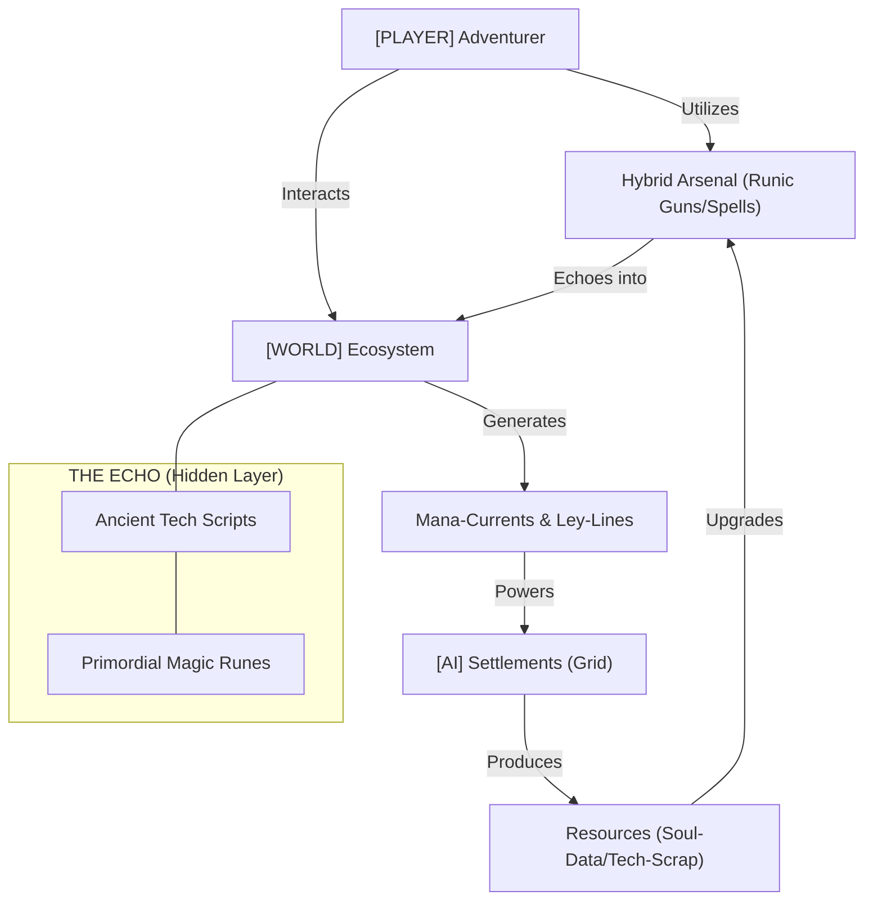

# 🌌 MASTER CONTEXT: Simple3DGame (Masterpiece 9.7)

Ostatnia aktualizacja: 2026-01-04
Status: **DARK FANTASY TECH-MAGIC FUSION OVERDRIVE**

---

## INFOGRAFIKA: TECH-MAGIC SYNERGY [9.7]

---

## 1. WIZJA: DARK FANTASY MAGITECH FUSION
Świat, w którym potężne zaklęcia są przesyłane przez światłowody, a dusze zmarłych służą jako procesory dla cybernetycznych golemów.

- **Cyber-Gothic Aesthetic**: Architektura łącząca strzeliste łuki z neonowymi kablami.
- **Mana-Currents**: Eteryczne rzeki energii płynące pod powierzchnią industrialnych miast.
- **The Echo**: Ślady dawnej cywilizacji, które gracze i osadnicy muszą odnaleźć i "zhakować" magicznie.

---

## 2. FILARY ROZGRYWKI (TRINITY)

### [PLAYER] MAGITECH ADVENTURER
Gracz operuje w trybie FPS/TPS, wykorzystując **Hybrid Arsenal**.
- **Mechanika Cast-Hacking**: Zaklęcia wymagają "połączenia" się z celem (raycast logic).
- **Movement**: Wspomagany przez magiczne dopalacze (mana-thrusters).

### [AI] AUTONOMOUS SOCIETY 9.7
Osadnicy to nie tylko zbieracze, to autonomiczne jednostki z systemem **Emergent Needs**.
- **Decision Matrix**: Osadnik wybiera zadania na podstawie globalnego stanu Frakcji i lokalnych potrzeb (Głód > Wiara > Praca).
- **Social Echo**: Osadnicy rozmawiają, tworząc plotki wpływające na morale kolonii.

### [WORLD] REGION DYNAMICS
Świat jest żywym organizmem podzielonym na **Regiony**.
- **Passive Tick**: Nawet gdy gracz jest daleko, regiony "oddychają" (lasy rosną, frakcje handlują).
- **Erozja Magiczna**: Środowisko zmienia się pod wpływem nadmiernego użycia technologii lub magii.

---

## 3. KONKRETNE PROPOZYCJE ROZWOJU (NEW PROPOSALS)

### [P1] SYSTEM LEY-LINE GRID (SIECI MOCY)
**Propozycja**: Wprowadzenie fizycznej sieci przesyłu energii w osadach.
- **Mechanika**: Gracz buduje runiczne przekaźniki (Power Nodes), które zasilają okoliczne budynki. 
- **Gameplay**: Przerwanie linii (np. przez atak wroga) paraliżuje produkcję w regionie.
- **Implementation**: Rozszerzenie `BuildingSystem` o system połączeń grafowych.

### [P2] CYBER-NECROMANCY (ASSETS AS DATA)
**Propozycja**: Wykorzystanie poległych wrogów jako zasobów.
- **Mechanika**: Możliwość "wskrzeszenia" fragmentów kodu golemów lub sfocusowania energii dusz w kryształach pamięci.
- **Gameplay**: Nowy typ zasobu: **Soul-Data**, używany do craftingu zaawansowanych AI osadników.

### [P3] DYNAMICZNE EKOSYSTEMY REGIONALNE
**Propozycja**: Wprowadzenie "Wildlife AI" reagującego na poziom tech-magii.
- **Mechanika**: Każdy region posiada parametr **Stable Aura**. Nadmiar technologii przyciąga mechaniczne bestie, nadmiar magii - eteryczne anomalie.
- **Gameplay**: Gracz musi balansować rozwój osady, by nie wywołać agresji świata.

---

## 4. ARCHITEKTURA TECHNICZNA 9.7

### Fundamenty Kodu
1. **ECS (Entity-Component-System)**: Pełna separacja danych od logiki.
2. **EventSystem (Interaction Echo)**: Każda akcja (np. wycięcie drzewa) emituje event, na który reaguje `WorldManager` i `Region`.
3. **DIContainer**: Zarządzanie zależnościami między systemami (Building, Crafting, UI).

### Kluczowe Systemy (Specs)
- [WorldManager & Region System](file:///f:/Simple3DGame/context_hub/specs/worldmanager_technical_spec.md) - Fundament skali sandboxa.
- [Player Trinity Architecture](file:///f:/Simple3DGame/context_hub/specs/player_trinity_technical_spec.md) - Hybrydowe sterowanie.
- [Faction & Diplomacy Logic](file:///f:/Simple3DGame/context_hub/specs/faction_system_technical_spec.md) - Żyjące frakcje AI.

---

## 5. ROADMAP: THE GREAT FUSION

### Phase 1: Foundations (NOW)
- [x] WorldManager & Region Grid.
- [/] FPS Input Pipeline Stabilization.
- [ ] Settler Needs System Refactor.

### Phase 2: Magitech Systems
- [ ] Implementacja Ley-Line Grid.
- [ ] Pierwsze Magitech Weapons (Runic Rifles).
- [ ] Region-based Wildlife AI.

---

## 6. KONSTYTUCJA DNA: MASTERPIECE 9.7
> [!IMPORTANT]
> **Nie budujemy plików, budujemy Ekosystem.** Kod pozbawiony "Juice'u" (estetyki i płynności) jest kodem niedokończonym. Każda zmiana musi podnosić standard projektu o 10%.

---
> [!IMPORTANT]
> Przy każdej zmianie w `Settler.cpp` lub `main.cpp`, sprawdź wpływ na `WorldManager` i regionalną symulację.
