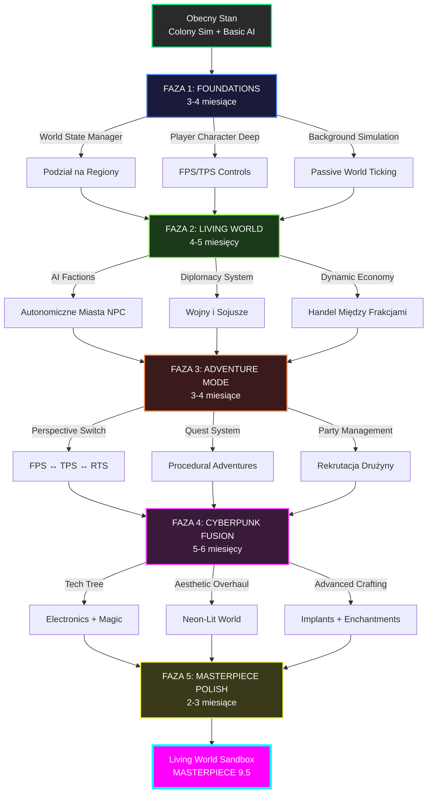
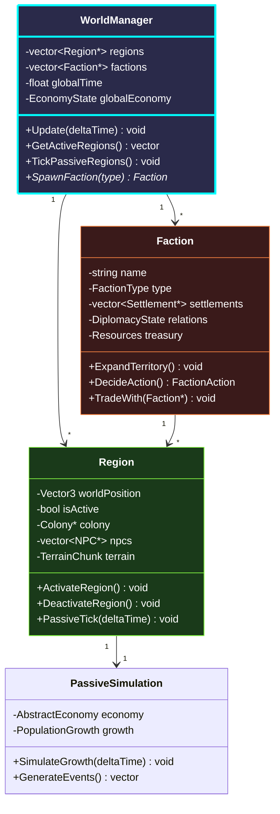
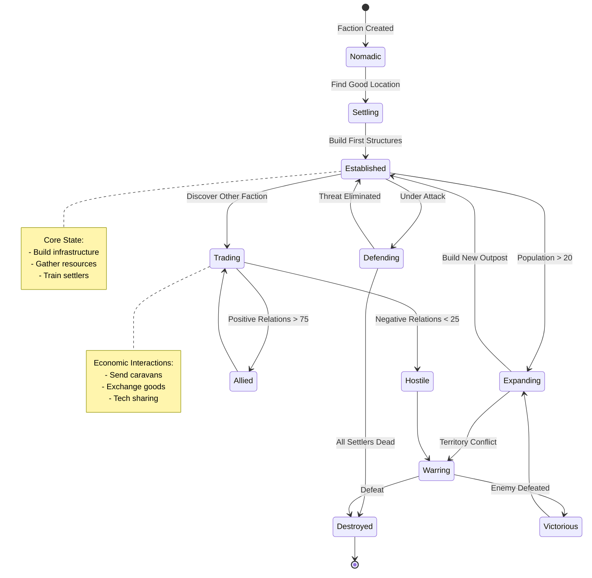
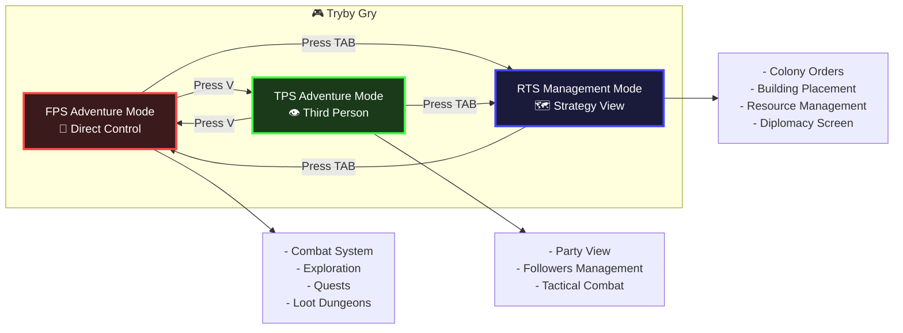
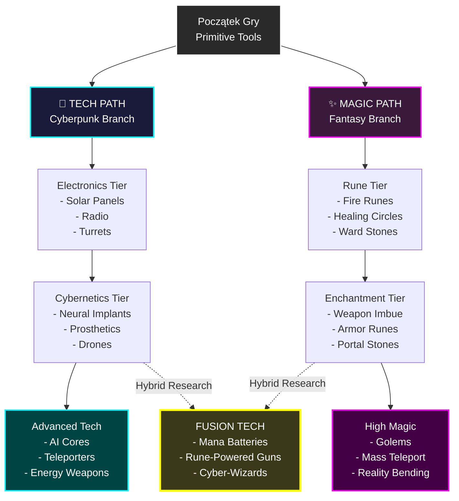
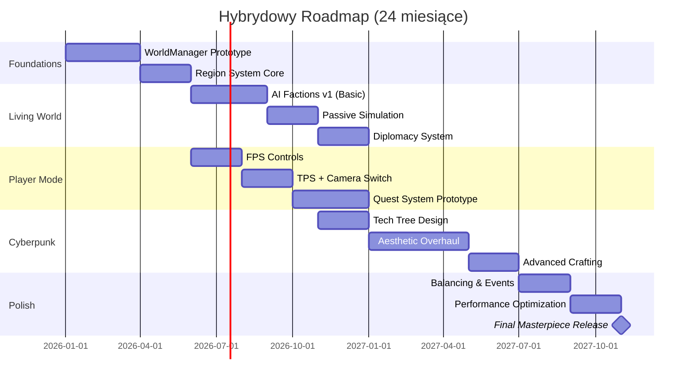

# 🌐 LIVING WORLD SANDBOX - MASTERPIECE VISION DOCUMENT

**Data utworzenia**: 2026-01-03  
**Rola**: [ARCHITEKT] + [REŻYSER] + [STRATEG]  
**Cel**: Transformacja Simple3DGame → Żyjący Symulator Społeczeństwa (Dwarf Fortress × Rimworld × Cyberpunk Fantasy)

---

## 📋 EXECUTIVE SUMMARY

### Wizja Techniczna
Przekształcenie obecnej gry survival-colonization w **pełnoprawny sandbox symulator życia społecznego**, gdzie:
- **Świat żyje niezależnie od gracza** - AI miasta rozwijają się w tle, wojny toczą się automatycznie
- **Przełączalne tryby gry** - FPS Adventure → Colony Management → World Strategy
- **Emergent Storytelling** - Historie powstają organicznie z interakcji systemów (jak w Dwarf Fortress)
- **Cyberpunk-Fantasy Fusion** - Estetyka neonowych osad obok magicznych ruin

### Fundamenty Techniczne (Już Masz!)
✅ **Solidny ECS Architecture** - Łatwa rozbudowa o nowe komponenty  
✅ **Colony + Settler AI** - Baza do rozbudowy o frakcje  
✅ **NavigationGrid + Pathfinding** - Gotowy na multiregion  
✅ **BuildingSystem + Crafting** - Szkielet tech progression  
✅ **Resource Management** - Baza dla ekonomii handlu  

---

## 🎯 ROADMAP ROZWOJU (5 FAZ)

---

## 🏗️ ARCHITEKTURA SYSTEMOWA - CURRENT vs TARGET

### Diagram Transformacji

```mermaid
graph LR
    subgraph CURRENT["🟢 OBECNY STAN (Colony Sim)"]
        direction TB
        CM[main.cpp<br/>Game Loop]
        CM --> COL[Colony.cpp<br/>Single Colony]
        COL --> SET[Settlers<br/>Basic AI]
        COL --> BUILD[BuildingSystem<br/>Static Structures]
        COL --> RES[Resources<br/>Local Storage]
        
        style CM fill:#1a4d1a,stroke:#00ff00,color:#fff
        style COL fill:#1a4d1a,stroke:#00ff00,color:#fff
    end
    
    subgraph TARGET["🔵 TARGET ARCHITECTURE (Living World)"]
        direction TB
        WM[WorldManager.cpp<br/>Global State]
        WM --> REG[RegionSystem<br/>Chunked World]
        WM --> FAC[FactionSystem<br/>AI Cities]
        WM --> PLAY[PlayerController<br/>FPS/TPS/RTS]
        
        REG --> |Active| ACT_REG[Active Regions<br/>Full Simulation]
        REG --> |Inactive| PASS_REG[Passive Regions<br/>Abstract Tick]
        
        FAC --> AI_CITY[AI Settlement<br/>Autonomous Growth]
        FAC --> DIPLO[DiplomacySystem<br/>Wars/Trade]
        
        PLAY --> FPS_MODE[FPS Adventure<br/>Direct Control]
        PLAY --> RTS_MODE[Colony Management<br/>Strategy View]
        
        style WM fill:#1a1a4d,stroke:#00ffff,color:#fff
        style TARGET fill:#0a0a2a,stroke:#00ffff,stroke-width:3px
    end
    
    CURRENT -.->|MIGRATION PATH| TARGET
```

---

## 🧩 KLUCZOWE NOWE SYSTEMY

### 1. **WorldManager** - Serce Żyjącego Świata

> [!IMPORTANT]
> To najbardziej krytyczny system - zarządza całym stanem świata i synchronizuje wszystkie regiony.

**Uzasadnienie Techniczne:**
- **Region System**: Podział świata na chunki (np. 100×100m) dla optymalizacji
- **Active vs Passive**: Tylko regiony w zasięgu gracza są w pełni symulowane
- **Passive Ticking**: Miasta AI używają abstrakcyjnych kalkulacji (wzrost populacji, produkcja) zamiast pełnej symulacji jednostek

---

### 2. **AI Faction System** - Autonomiczne Społeczeństwa

**Kluczowe Mechaniki:**
- **Autonomous Decision Making**: AI frakcje działają niezależnie (budują, handlują, walczą)
- **Emergent Diplomacy**: Relacje kształtują się dynamicznie (sojusze, wojny, handel)
- **Cultural Identity**: Każda frakcja ma unique tech tree i estetykę

---

### 3. **Player Character Trinity** - Trzy Tryby Gry

**Implementacja Techniczna:**
- **Camera System Refactor**: Jeden `CameraController` z trzema stanami
- **Input Context Switching**: Różne bindy klawiszy dla każdego trybu
- **UI Adaptation**: UI dynamicznie pokazuje relevantne informacje dla trybu

---

### 4. **Cyberpunk-Fantasy Tech Tree**

---

## 🎨 WIZUALIZACJA KONCEPTOWA (Creative Juice)

### Klimat: Neon-Fantasy Settlements

**Przykładowe Scene:**
1. **Osada gracza o zmierzchu**: Drewniane palisady z neonowymi paskami LED, ognisko pośrodku, hologramy pokazują mapę okolicy
2. **AI City - Cyberpunk Quarter**: Wieżowce z blachy i drewna, neony reklamowe, parujące kratki, NPC handlują na bazarze
3. **Magiczny Dungeon**: Starożytne ruiny świecące runami, levitujące platformy, krystaliczne formacje

*(Wygeneruję te wizualizacje za chwilę)*

---

## 🔀 ŚCIEŻKI IMPLEMENTACJI - BEZPIECZNA vs MASTERPIECE

### Opcja A: **BEZPIECZNA** (Ewolucyjna) - 12-18 miesięcy

> [!NOTE]
> Minimalizuje ryzyko techniczne, zachowuje backward compatibility.

**Strategia:**
1. Dodawaj systemy incremental (najpierw RegionSystem, potem Factions)
2. Utrzymuj obecny Colony.cpp jako legacy fallback
3. Każda faza ma working prototype

**Pros:**
✅ Niskie ryzyko broke existing features  
✅ Możliwość publikowania wczesnych wersji  
✅ Łatwiejsze debugowanie (jedna zmiana na raz)  

**Cons:**
❌ Wolniejsze tempo  
❌ Technicznym debt (legacy code pozostaje)  
❌ Mniej spójny design (łatki zamiast redesign)

---

### Opcja B: **MASTERPIECE AAA** (Rewolucyjna) - 18-24 miesiące

> [!WARNING]
> Wymaga pełnego refactoru core architecture. Wysokie ryzyko, ale maksymalna jakość.

**Strategia:**
1. **Krok 1-3 miesiące**: Prototyp WorldManager + RegionSystem (nowy branch)
2. **Krok 2-4 miesiące**: Migracja Colony → Region + Faction systems
3. **Krok 3-6 miesięcy**: Player Character trinity + FPS combat
4. **Krok 4-5 miesięcy**: Cyberpunk-Fantasy aesthetic overhaul
5. **Krok 5-3 miesiące**: Polish + balancing

**Pros:**
✅ Czysta architektura od podstaw  
✅ Lepsze fundamenty dla przyszłych feature'ów  
✅ Prawdziwe "Living World" (nie symulacja)  

**Cons:**
❌ Długi okres bez playable build  
❌ Wysokie ryzyko scope creep  
❌ Trudniejszy rollback jeśli coś pójdzie nie tak  

---

## 🏆 REKOMENDACJA [ARCHITEKT]

### Hybrydowa Ścieżka: **"Modular Masterpiece"**

> [!IMPORTANT]
> Łączę bezpieczeństwo Opcji A z ambicją Opcji B.

**Strategia 3-torowa:**

**Kluczowe Założenia:**
1. **Równoległy Development**: Systemy WorldManager i Player Character rozwijane jednocześnie
2. **Vertical Slices**: Co 3 miesiące masz playable vertical slice (np. "1 AI faction + FPS mode działa")
3. **Fallback Points**: Jeśli Factions okaże się za trudne, fallback to "better Colony AI"

---

## ❓ PYTANIA BLOKUJĄCE DLA PARTNERA

> [!CAUTION]
> Te decyzje muszą być podjęte **przed** rozpoczęciem implementacji.

### 1. **Scope & Timeline**
- **Q1**: Jaki masz horyzont czasowy? (6M / 12M / 24M+)
- **Q2**: Czy to projekt solo, czy planujesz team expansion?
- **Q3**: Priorytet: Szybki MVP vs Długoterminowy Masterpiece?

### 2. **Techniczna Wizja**
- **Q4**: Akceptujesz pełny refactor core systems (WorldManager zamiast Colony)?
- **Q5**: Czy zgadzasz się na **porzucenie backward compatibility** z obecnym save system?
- **Q6**: Maksymalny rozmiar świata: 1km² / 10km² / unlimited procedural?

### 3. **Gameplay Focus**
- **Q7**: Co jest core loop: Adventure (FPS) czy Management (RTS)?
- **Q8**: Multiplayer w planach? (Drastycznie zmieni architekturę)
- **Q9**: Preferujesz więcej Dwarf Fortress (complexity) czy Rimworld (accessibility)?

### 4. **Estetyka**
- **Q10**: Cyberpunk:Fantasy ratio? (50:50 / 70:30 / choose at start?)
- **Q11**: 3D models: Low-poly stylized czy realistic?
- **Q12**: Voice acting / Text-only / Mixed?

---

## 📊 RISK ASSESSMENT

| Ryzyko | Prawdopodobieństwo | Impact | Mitigation |
|--------|-------------------|--------|------------|
| **Scope Creep** | 🔴 Wysokie | 🔴 Krytyczny | Locked milestones, vertical slices |
| **Performance (World Size)** | 🟡 Średnie | 🔴 Krytyczny | Spatial partitioning, LOD system |
| **AI Complexity** | 🟡 Średnie | 🟡 Średnie | Start z prostymi state machines |
| **Legacy Code Debt** | 🟢 Niskie | 🟡 Średnie | Refactor w fazie 1 |
| **Art Asset Volume** | 🔴 Wysokie | 🟡 Średnie | Procedural generation + asset packs |

---

## 🚀 NATYCHMIASTOWE NEXT STEPS (Po Aprobacie)

1. **[ARCHITEKT]** Stworzyć `WorldManager.h` prototype
2. **[PROJEKTANT]** Wygenerować concept art dla 3 scene types
3. **[STRATEG]** Zaprojektować Region serialization format
4. **[DEBUGGER]** Audit obecnego Colony.cpp (co można reuse?)
5. **[REŻYSER]** Napisać Game Design Document dla FPS combat feel

---

## 📸 VISUAL KONCEPTS - Klimat Gry

### 🌆 Scene 1: Neon Settlement at Dusk
*Osada gracza o zmierzchu - połączenie średniowiecznej konstrukcji z cyberpunk estetyką*

**Design Notes:**
- Drewniane palisady z wbudowanymi neonowymi paskami LED (cyan/magenta)
- Holograficzne projekcje map i danych
- Kontrast ciepłego ognia z zimnymi akcentami neonowymi
- Solar panele na prymitywnych budynkach

---

### 🏙️ Scene 2: AI City Marketplace
*Autonomiczne miasto NPC - tętniący życiem bazar cyberpunk*

**Design Notes:**
- Budynki z łączonych materiałów (metal + drewno + beton)
- NPC z cybernetic implants i fantasy robes
- Holograficzne reklamy i neony w obcych językach
- Living, breathing atmosphere - miasto żyje niezależnie od gracza

---

### ⚔️ Scene 3: Magical Dungeon Ruins
*FPS Adventure Mode - eksploracja magicznych ruin*

**Design Notes:**
- Pierwszoosobowa perspektywa dla immersion
- Świecące runy i krystaliczne formacje
- Levitujące platformy (puzzle elements)
- Atmospheric lighting - dramatyczne promienie światła
- Particle effects (mgła, iskry magii, pył)

---

### 🌳 Scene 4: Tech Tree Interface
*Dual-path progression system - Tech vs Magic*

**Design Notes:**
- Cyberpunk branch (niebieski) vs Fantasy branch (fioletowy)
- Centralny Fusion path (złoty) dla hybrydowych technologii
- Holograficzny UI z ikonami
- Czysty, czytelny design dla szybkiej nawigacji

---

### 🤝 Scene 5: Faction Diplomacy Screen
*RTS Management Mode - zarządzanie relacjami między frakcjami*

**Design Notes:**
- Centralny diagram relacji (kolor = status relacji)
- Panel info frakcji z portretem i statystykami
- Akcje dyplomatyczne (Trade, War, Alliance)
- Neon accents (cyan, magenta, gold) na dark background
- Premium, AAA-quality UI design

---

## 🎯 KOŃCOWE SŁOWO [ARCHITEKT]

Partnerze, masz **solidne fundamenty** w postaci działającego ECS i nawigacji. To nie jest "start from scratch" - to **evolution**.

**Moja rekomendacja:** Zacznij od **Fazy 1 (Foundations)** z opcją **Modular Masterpiece**. W 3 miesiące masz:
- ✅ WorldManager działający
- ✅ FPS controls functional
- ✅ Pierwszy prototyp AI faction

A potem decydujemy: push dalej czy pivot.

**To będzie Arcydzieło. Ale potrzebuję Twoich odpowiedzi na pytania blokujące.**

---

*Dokument stworzony przez: Antigravity AI [ARCHITEKT MODE]*  

## 🤖 AI Faction Prototype Implementation Plan (Phase 0 - Week 2)

**Cel**: Stworzenie pierwszej autonomicznej frakcji NPC, która "żyje" w tle (simulated in passive mode).

### 1. Nowe Klasy
*   **`game/Faction.h/cpp`**:
    *   Klasa bazowa dla frakcji.
    *   Zarządza zasobami (Treasury) i listą osad.
    *   `Update(deltaTime)`: Główna pętla decyzyjna (prosty behawioryzm: zbierz surowce -> zbuduj).
*   **`game/Settlement.h/cpp`**:
    *   Reprezentuje miasto/osadę NPC.
    *   Posiada `name`, `population`, `buildings`.
    *   `PassiveTick(deltaTime)`: Symuluje wzrost i produkcję.
    *   **Auto-Expanion**: Co 30s próbuje postawić budynek (w logicznym miejscu).

### 2. Integracja z WorldManager
*   `WorldManager` będzie posiadał listę `std::vector<std::unique_ptr<Faction>>`.
*   W `WorldManager::Update`: wywołanie `faction->Update(dt)` dla wszystkich frakcji.

### 3. Wizualizacja (Debug)
*   Rozszerzenie `WorldManager::DrawDebugInfo()` o wyświetlanie statusu frakcji (np. "Faction: Empire | Gold: 100 | Settlements: 1").
*   Opcjonalnie: Rysowanie prostych ikon/markerów w miejscu osad NPC na gridzie.

### 4. Scope (Prototype Constraints)
*   **Brak fizycznych NPC**: Frakcja to tylko "liczby" i budynki (Phase 2 doda fizyczne jednostki).
*   **Brak dyplomacji**: Frakcje na razie ignorują się nawzajem.
*   **Hardcoded Behavior**: Zamiast pełnego drzewa decyzji, prosta maszyna stanów (`GATHER` -> `BUILD`).
