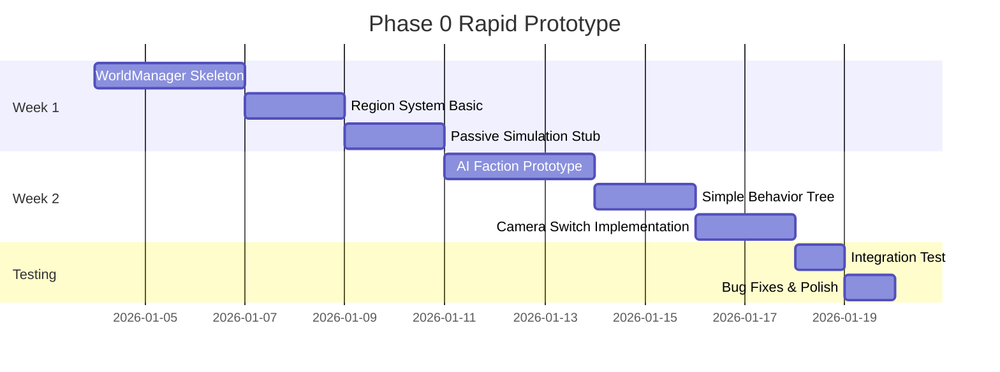

# Phase 0: Rapid Prototype - Quick Start Guide

**Cel**: Zbudować **Proof of Concept** dla kluczowych systemów w 2-3 tygodnie  
**Strategia**: Minimal Viable Implementation - działający prototyp zamiast pełnej funkcjonalności  
**Sukces**: Gracz widzi pierwsze AI miasto budujące się w tle podczas gdy eksploruje w FPS

---

## 🎯 Zakres Phase 0 (MVP)

### ✅ CO IMPLEMENTUJEMY:
1. **WorldManager Prototype** (5-7 dni)
   - Podział świata na 3x3 regiony (statyczny grid)
   - Aktywacja regionu gdy gracz wchodzi
   - Podstawowa passive simulation (abstract population growth)

2. **Single AI Faction** (5-7 dni)
   - Jedna testowa frakcja NPC (typ: BUILDER)
   - Prosty behavior tree (tylko: Expand → Build → Grow)
   - Automatyczne spawanie budynków w czasie

3. **FPS/RTS Camera Switch** (3-4 dni)
   - Przełączanie TAB między FPS a RTS view
   - Smooth camera transition (0.5s)
   - Podstawowy UI indicator

### ❌ CO POMIJAMY (na razie):
- TPS mode (zostaje tylko FPS + RTS)
- Pełny diplomacy system
- Trade caravans
- War system
- Cyberpunk aesthetic overhaul
- Party/followers system

---

## 📋 Implementation Timeline (2 tygodnie)



---

## 🛠️ Detailed Implementation Steps

### KROK 1: WorldManager Skeleton (Dzień 1-3)

**Pliki do stworzenia:**
- `game/WorldManager.h`
- `game/WorldManager.cpp`
- `game/Region.h`
- `game/Region.cpp`

**Kod Prototype:**

```cpp
// game/WorldManager.h
#pragma once
#include <vector>
#include <memory>
#include "raylib.h"

class Region;
class Colony;

class WorldManager {
private:
    static WorldManager* instance;
    std::vector<std::unique_ptr<Region>> regions;
    Vector3 playerPosition;
    
    static const int GRID_SIZE = 3; // 3x3 grid
    static const float REGION_SIZE; // 100.0f meters
    
public:
    static WorldManager* GetInstance();
    
    void Initialize();
    void Update(float deltaTime, Vector3 playerPos);
    void Render();
    
    Region* GetRegionAt(Vector3 worldPos);
    std::vector<Region*> GetActiveRegions();
    
private:
    void UpdateRegionActivation();
    Vector2 WorldPosToGrid(Vector3 pos);
};

// game/Region.h
#pragma once
#include "raylib.h"
#include <memory>

class Colony;
class Terrain;

enum class RegionState {
    UNINITIALIZED,
    PASSIVE,
    ACTIVE
};

class Region {
private:
    Vector2 gridCoord; // Grid position
    Vector3 worldCenter; // World space center
    RegionState state = RegionState::UNINITIALIZED;
    
    std::unique_ptr<Colony> colony;
    std::unique_ptr<Terrain> terrain;
    
    // Passive simulation data
    float abstractPopulation = 0.0f;
    float abstractFood = 100.0f;
    
public:
    Region(Vector2 coord, Vector3 center);
    
    void ActivateFullSimulation();
    void DeactivateToPassive();
    void PassiveTick(float deltaTime);
    void Update(float deltaTime);
    void Render();
    
    bool IsActive() const { return state == RegionState::ACTIVE; }
    Vector3 GetCenter() const { return worldCenter; }
    Colony* GetColony() { return colony.get(); }
};
```

**Integracja z main.cpp:**

```cpp
// main.cpp - modified initialization
void Initialize() {
    // ... existing code ...
    
    // Initialize WorldManager
    WorldManager* world = WorldManager::GetInstance();
    world->Initialize();
}

// main.cpp - modified update loop
void Update(float deltaTime) {
    // Update WorldManager (handles region activation)
    WorldManager* world = WorldManager::GetInstance();
    world->Update(deltaTime, player.position);
    
    // Update only active region's colony
    Region* currentRegion = world->GetRegionAt(player.position);
    if (currentRegion && currentRegion->IsActive()) {
        Colony* colony = currentRegion->GetColony();
        if (colony) {
            colony->update(deltaTime, trees, buildings);
        }
    }
}
```

---

### KROK 2: AI Faction Prototype (Dzień 4-6)

**Pliki do stworzenia:**
- `game/Faction.h`
- `game/Faction.cpp`
- `game/Settlement.h`
- `game/Settlement.cpp`

**Minimal Behavior:**

```cpp
// game/Faction.h
#pragma once
#include <string>
#include <vector>
#include "raylib.h"

class Settlement;
class Region;

enum class FactionType {
    BUILDER,    // For prototype - just builds
    MERCHANT,
    MILITARIST
};

class Faction {
private:
    std::string name;
    FactionType type;
    std::vector<Settlement*> settlements;
    
    float actionTimer = 0.0f;
    static constexpr float ACTION_INTERVAL = 30.0f; // 30 seconds per action
    
public:
    Faction(std::string name, FactionType type);
    
    void Update(float deltaTime);
    void DecideAndExecuteAction();
    
    void FoundSettlement(Vector3 location, Region* region);
    std::vector<Settlement*> GetSettlements() { return settlements; }
};

// game/Settlement.h
class Settlement {
private:
    std::string name;
    Vector3 position;
    Faction* owner;
    int population = 10;
    std::vector<Building*> buildings;
    
    float growthTimer = 0.0f;
    
public:
    Settlement(Vector3 pos, Faction* owner);
    
    void Update(float deltaTime);
    void GrowPopulation();
    void BuildRandomStructure();
    void Render();
};
```

**Simple Behavior Tree (hardcoded for prototype):**

```cpp
void Faction::DecideAndExecuteAction() {
    // Super simple AI - just expand and build
    
    if (settlements.empty()) {
        // Found first settlement
        Vector3 spawnPos = {50, 0, 50}; // Random location
        FoundSettlement(spawnPos, nullptr);
        return;
    }
    
    // If population is sufficient, found new settlement
    int totalPop = 0;
    for (Settlement* s : settlements) {
        totalPop += s->GetPopulation();
    }
    
    if (totalPop > 30 && settlements.size() < 3) {
        // Expand - found new settlement nearby
        Vector3 newPos = settlements[0]->GetPosition();
        newPos.x += RandomFloat(-100, 100);
        newPos.z += RandomFloat(-100, 100);
        FoundSettlement(newPos, nullptr);
    } else {
        // Build in existing settlements
        for (Settlement* s : settlements) {
            s->BuildRandomStructure();
        }
    }
}
```

---

### KROK 3: Camera Switch (Dzień 7-9)

**Pliki do modyfikować:**
- `src/main.cpp`

**Implementation:**

```cpp
enum class CameraMode {
    FPS,
    RTS
};

struct CameraState {
    Vector3 position;
    Vector3 target;
    float fov;
};

class CameraController {
private:
    Camera3D camera;
    CameraMode currentMode = CameraMode::FPS;
    bool isTransitioning = false;
    float transitionProgress = 0.0f;
    CameraState startState, targetState;
    
public:
    void SwitchMode(CameraMode newMode) {
        if (currentMode == newMode) return;
        
        // Start transition
        startState = GetCurrentState();
        targetState = GetTargetStateForMode(newMode);
        isTransitioning = true;
        transitionProgress = 0.0f;
        currentMode = newMode;
    }
    
    void Update(float deltaTime, Vector3 playerPos) {
        if (isTransitioning) {
            transitionProgress += deltaTime * 2.0f; // 0.5s transition
            
            if (transitionProgress >= 1.0f) {
                transitionProgress = 1.0f;
                isTransitioning = false;
            }
            
            float t = EaseInOutCubic(transitionProgress);
            camera.position = Vector3Lerp(startState.position, targetState.position, t);
            camera.target = Vector3Lerp(startState.target, targetState.target, t);
            camera.fovy = Lerp(startState.fov, targetState.fov, t);
        } else {
            // Normal update
            if (currentMode == CameraMode::FPS) {
                UpdateFPS(playerPos);
            } else {
                UpdateRTS(playerPos);
            }
        }
    }
    
private:
    CameraState GetTargetStateForMode(CameraMode mode) {
        if (mode == CameraMode::FPS) {
            return {
                .position = player.position + Vector3{0, 1.7f, 0},
                .target = player.position + player.forward,
                .fov = 75.0f
            };
        } else { // RTS
            return {
                .position = player.position + Vector3{0, 30, -20},
                .target = player.position,
                .fov = 60.0f
            };
        }
    }
};

// In main loop
if (IsKeyPressed(KEY_TAB)) {
    CameraMode newMode = (cameraController.GetMode() == CameraMode::FPS) 
                        ? CameraMode::RTS : CameraMode::FPS;
    cameraController.SwitchMode(newMode);
}
```

---

## 🧪 Testing Checklist

Po implementacji wszystkich kroków, testuj:

- [ ] **WorldManager**: Czy regiony aktywują się gdy gracz się porusza?
- [ ] **Passive Sim**: Czy nieaktywne regiony mają abstract population counter?
- [ ] **AI Faction**: Czy NPC faction buduje nowe budynki co 30s?
- [ ] **Settlement Growth**: Czy AI settlements rosną (nowe budynki)?
- [ ] **Camera Switch**: Czy TAB płynnie przełącza FPS ↔ RTS?
- [ ] **Performance**: Czy FPS >= 60 z 9 regionami (3x3)?

---

## 🎯 Success Criteria

**Prototype jest GOTOWY gdy:**
1. ✅ Gracz może chodzić w FPS mode
2. ✅ Gracz może przełączyć do RTS view (TAB)
3. ✅ AI faction ma 1-3 settlements widoczne
4. ✅ AI settlements automatycznie budują nowe struktury (1 co 30s)
5. ✅ Regiony aktywują/deaktywują się gdy gracz się porusza
6. ✅ Gra działa >= 60 FPS

---

## 📊 Expected Results (Screenshots)

Po ukończeniu Phase 0, powinieneś zobaczyć:
- **FPS View**: Normalny gameplay jak teraz
- **RTS View** (po TAB): Camera z góry, widać swoją kolonię + AI settlement w oddali
- **AI Settlement**: 3-5 budynków spawnionych przez AI (bez ingerencji gracza)
- **Console Log**: "Faction [NomadBuilder] founded settlement", "Settlement [AI-Town-1] constructed HOUSE"

---

## 🚀 Next Steps po Phase 0

Jeśli prototype działa:
1. **Expand AI**: Dodać więcej factions (2-3)
2. **Diplomacy v1**: Basic relation tracking
3. **Trade Prototype**: Single caravan traveling between settlements
4. **TPS Mode**: Third person camera
5. **Tech Tree**: Unlock system prototype

---

*Ten dokument jest "executable plan" - każdy krok ma konkretny kod do napisania.*  
*Estimated Time: 10-14 dni roboczych (2-3 tygodnie)*

**Gotowy zacząć? Powiedz czy mam ruszyć z KROK 1: WorldManager Skeleton! 🚀**
