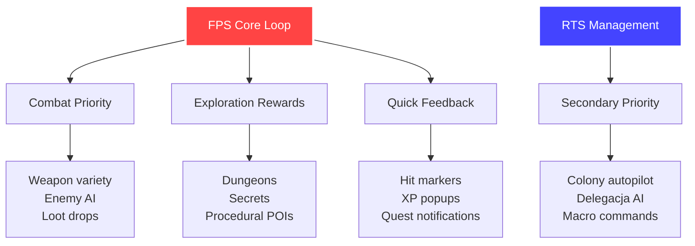
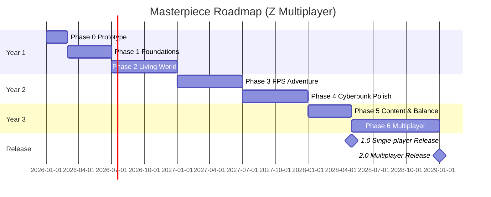

# Decision Impact Analysis - Konsekwencje Twoich Wyborów

**Data**: 2026-01-03  
**Rola**: [STRATEG] + [ARCHITEKT]  

---

## 📋 Podsumowanie Decyzji

| Pytanie | Twoja Odpowiedź | Impact Level |
|---------|----------------|--------------|
| Q1: Horyzont czasowy | "Nie spieszy mi się" (24M+) | 🟢 Positive |
| Q2: Team size | Solo | 🟡 Medium |
| Q3: MVP vs Masterpiece | Długoterminowy Masterpiece | 🟢 Positive |
| Q4: Refactor core systems | TAK | 🟢 Positive |
| Q5: Porzucić backward compatibility | TAK | 🟢 Positive |
| Q6: Rozmiar świata | Procedural + odkrywanie | 🟢 Positive |
| Q7: Core loop | **FPS Adventure** | 🔵 Defining |
| Q8: Multiplayer | **TAK** | 🔴 **CRITICAL** |
| Q9: Complexity | *(wyjaśnienie poniżej)* | - |
| Q10: Cyberpunk:Fantasy ratio | 50/50 | 🟢 Positive |
| Q11: Art style | Zwykłe modele → realistic | 🟢 Positive |
| Q12: Audio | Generowane głosy (TTS) | 🟡 Medium |

---

## 🤔 Q9: Dwarf Fortress vs Rimworld - Wyjaśnienie

### Dwarf Fortress (Complexity)
**Filozofia**: "Emergent storytelling through simulation depth"

**Przykłady mechanik:**
- Każdy settler ma **indywidualną psychologię** (trauma, fobia, relationships)
- **Geologia realistyczna** - warstwy skał, żyły rud, underground rivers
- **Ekonomia głęboka** - towary mają wartość bazującą na jakości craftu, materiałach, rzadkości
- **Historie generowane** - "Urist McMiner zabił goblin włócznią zrobioną przez Bomrek Coppersmith z żelaza wydobytego w roku 253"
- **Skomplikowane UI** - krzywa uczenia się jak Mount Everest

**Korzyści:**
✅ Każda rozgrywka to unikalna legenda  
✅ Gracze spędzają setki godzin odkrywając depth  
✅ Community tworzy legendarne historie ("Boatmurdered")  

**Wady:**
❌ Bardzo trudna dla nowych graczy  
❌ UI nightmare (ASCII lub tile-based chaos)  
❌ Performance issues przy dużych populacjach  

---

### Rimworld (Accessibility)
**Filozofia**: "Guided emergent stories with clear UI"

**Przykłady mechanik:**
- **Uproszczona psychologia** - mood stats z jasnymi przyczynami (breakdowns, inspirations)
- **Przejrzyste systemy** - każdy bonus/malus jest wyraźnie pokazany
- **Storyteller AI** - Randy/Cassandra kontrolują trudność eventów
- **Czytelny UI** - wszystko jest intuicyjne, tooltips wszędzie
- **Modular complexity** - vanilla jest łatwy, mods dodają depth

**Korzyści:**
✅ Łatwy start, trudny mastery  
✅ Szeroka audience (miliony graczy)  
✅ Przejrzysty feedback (wiesz DLACZEGO coś się dzieje)  

**Wady:**
❌ Mniej "woah moments" (symulacja jest uproszczona)  
❌ Niektórzy gracze czują się "on rails" (Storyteller kontroluje chaos)  

---

### 🎯 Moja Rekomendacja dla Twojego Projektu

**Hybrid: "Rimworld Core + Dwarf Fortress Moments"**

```
Accessibility (Rimworld)          Complexity (Dwarf Fortress)
├─ Clear UI/UX                    ├─ Deep psychology (optional)
├─ Tooltips everywhere            ├─ Procedural history tracking
├─ Guided tutorials               ├─ Complex geology (advanced)
└─ Difficulty scaling             └─ Emergent legends generation
```

**Konkretnie:**
1. **UI/UX**: Inspiruj się Rimworld (clarity > complexity)
2. **Core systems**: Proste w vanilla, depth przez expansion/mods
3. **Emergent storytelling**: Trackuj legendy jak DF, ale opcjonalnie
4. **Difficulty**: Difficulty slider (Hardcore mode = DF-style chaos)

**Dlaczego?**
- Solo dev = accessibility jest kluczowa (nie masz QA teamu do testowania złożoności)
- FPS core loop = gracz potrzebuje szybkiego feedbacku (nie może spędzić 2h ucząc się UI)
- Multiplayer = musi być intuicyjny dla nowych graczy dołączających do świata

---

## 🔴 CRITICAL IMPACT: Multiplayer Decision

> [!CAUTION]
> **Multiplayer = Prawie podwojenie scope całego projektu!**

### Konsekwencje Techniczne

#### 1. **Architektura - Network Layer**

**Bez Multiplayer:**
```cpp
// Prosty single-player flow
void Update() {
    ProcessInput();
    UpdateGameState();
    Render();
}
```

**Z Multiplayer:**
```cpp
// Client-Server architecture required
void ClientUpdate() {
    ProcessInput();
    SendInputToServer();    // Network send
    ReceiveStateFromServer(); // Network receive
    InterpolateState();     // Smoothing
    Render();
}

void ServerUpdate() {
    ReceiveInputsFromAllClients();
    AuthoritativeSimulation();  // Server decides truth
    BroadcastStateToClients();
}
```

**Nowe Systemy Potrzebne:**
- **NetworkManager** - Connection handling, packet serialization
- **Replication System** - Sync game state (settlers, buildings, factions)
- **Interpolation/Prediction** - Smooth movement despite latency
- **Authority System** - Who owns what entity (prevent cheating)
- **Lobby System** - Matchmaking, server browser

**Estimated Additional Development Time:** +8-12 miesięcy

---

#### 2. **Determinism & Synchronization**

**Problem:**
W single-player, AI może używać `rand()` bez problemu. W multiplayer, wszystkie klienty muszą mieć **identyczny game state**.

**Rozwiązanie:**
```cpp
// Deterministyczny RNG z shared seed
class DeterministicRandom {
    uint64_t seed;
public:
    void SetSeed(uint64_t s) { seed = s; }
    float NextFloat() {
        seed = (seed * 1103515245 + 12345) & 0x7fffffff;
        return (float)seed / 0x7fffffff;
    }
};

// Server wysyła seed do wszystkich klientów
void ServerStartGame() {
    uint64_t worldSeed = GenerateSeed();
    BroadcastToAllClients(MessageType::WORLD_SEED, worldSeed);
}
```

---

#### 3. **FPS Combat - Latency Challenges**

**Problem:**
W FPS, latency = śmierć. Gracz strzela, ale przeciwnik widzi to 100ms później.

**Rozwiązania:**
- **Client-side prediction**: Gracz widzi natychmiastowy feedback
- **Server reconciliation**: Server weryfikuje czy hit był legalny
- **Lag compensation**: Server "rewinds" time aby sprawdzić hit detection

**Example Implementation:**
```cpp
// Client: Instant feedback
void ClientShoot() {
    // Show bullet immediately (prediction)
    SpawnBulletVisual(gun.position, gun.direction);
    
    // Send to server for verification
    SendShootCommand(gun.position, gun.direction, localTimestamp);
}

// Server: Authoritative check
void ServerProcessShoot(ShootCommand cmd) {
    // Rewind world state to client's timestamp
    WorldState historicalState = GetStateAtTime(cmd.timestamp);
    
    // Check if hit was valid
    if (RaycastHit(cmd.position, cmd.direction, historicalState)) {
        // Confirm hit, broadcast to all
        BroadcastDamageEvent(targetEntity, damage);
    } else {
        // Reject (client was wrong)
        SendCorrectionToClient(cmd.clientId);
    }
}
```

**Dodatkowa Złożoność:** High (wymaga doświadczenia w network programming)

---

#### 4. **Persistent World Problem**

**Twoja Wizja:** Świat żyje nawet gdy gracze są offline (jak DF)

**Multiplayer Questions:**
- Czy server działa 24/7? (Dedicated server = koszt hostingu)
- Czy AI factions działają offline? (Wymaga server processing)
- Jak gracz "host" wychodzi z gry? (Transfer ownership?)

**Opcje:**

**A) Dedicated Server (Recommended for Masterpiece)**
```
Pros:
✅ Świat żyje zawsze (24/7 simulation)
✅ Brak "host advantage"
✅ Możliwość persistent world (save state na serwerze)

Cons:
❌ Wymaga wynajęcia serwera ($10-50/miesiąc)
❌ Server code oddzielnie od client code
❌ Maintenance i monitorowanie
```

**B) Peer-to-Peer (Easier dla solo dev)**
```
Pros:
✅ Darmowy (gracze hostują)
✅ Prostszy w implementacji

Cons:
❌ "Host advantage" (host ma 0 ping)
❌ Świat umiera gdy host wyłącza grę
❌ Trudniejszy matchmaking
```

**Moja Rekomendacja:** Start z **singleplayer**, dodaj multiplayer w **Phase 4-5** (rok 1.5-2).

---

## 🌍 Q6: Procedural Generation + Odkrywanie

**Twoja Decyzja:** "Procedural ale generowany w miarę odkrywania"

**To oznacza:** Minecraft-style chunk generation

### Implementacja

```cpp
class WorldGenerator {
private:
    uint64_t worldSeed;
    map<ChunkCoord, Chunk*> generatedChunks;
    
public:
    Chunk* GetOrGenerateChunk(ChunkCoord coord) {
        if (generatedChunks.find(coord) == generatedChunks.end()) {
            // Generate new chunk on-demand
            Chunk* newChunk = GenerateChunk(coord, worldSeed);
            generatedChunks[coord] = newChunk;
        }
        return generatedChunks[coord];
    }
    
    Chunk* GenerateChunk(ChunkCoord coord, uint64_t seed) {
        // Procedural generation based on seed + coordinates
        Terrain terrain = GenerateTerrain(coord, seed);
        SpawnResources(terrain, seed);
        SpawnStructures(terrain, seed); // Ruins, villages
        SpawnAnimals(terrain, seed);
        
        return new Chunk(coord, terrain);
    }
};
```

### Konsekwencje

**Pozytywne:**
✅ **Nieskończony świat** (ograniczony tylko RAM)
✅ **Performance** - nie generujesz całego świata od razu
✅ **Replayability** - każdy seed = unikalny świat

**Wyzwania:**
⚠️ **Consistency** - jak synchronizować proceduralny świat w multiplayer?
⚠️ **Save system** - musisz zapisywać tylko "modified chunks" (seed odtwarza resztę)
⚠️ **AI Factions** - jak AI builduje miasta w niegenerowanych chunkach?

**Rozwiązanie dla AI:**
```cpp
// AI może "zarezerwować" lokację bez pełnej generacji
class Faction {
    void FoundSettlement(ChunkCoord coord) {
        // Mark chunk as "claimed" in metadata (nie generuj pełnego chunka)
        worldMetadata.claimChunk(coord, this);
        
        // When player gets close, THEN generate full chunk
        // z AI buildings already placed
    }
};
```

---

## 🎮 Q7: FPS jako Core Loop

**Twoja Decyzja:** FPS jest priorytetem

### Wpływ na Design



**To znaczy:**
1. **Combat musi być AAA quality** - Tight controls, satisfying gunplay
2. **Colony management jest "support system"** - Nie główny gameplay
3. **Questy i dungeons** - Proceduralne adventures jako content
4. **Progression** - Player power scaling (levels, gear, skills)

**Comparison:**
- **FPS Priority (Twój wybór):** Jak Skyrim + Rimworld
- **RTS Priority (alternatywa):** Jak Dwarf Fortress + FPS mode

---

## 📊 Final Impact Summary

| Decyzja | Timeline Impact | Complexity | Budget Impact |
|---------|----------------|------------|---------------|
| Długoterminowy Masterpiece | +12M | 🔴 High | $0 (czas, nie $) |
| Full Refactor | +2M | 🟡 Medium | $0 |
| Procedural World | +3M | 🟡 Medium | $0 |
| FPS Core | +0M | 🟢 Low | $0 |
| **MULTIPLAYER** | **+12M** | **🔴🔴 Very High** | **$10-50/miesiąc (serwer)** |
| 50/50 Cyberpunk/Fantasy | +1M | 🟢 Low | $0-500 (assety) |
| Generowane głosy | +1M | 🟡 Medium | $0-22/miesiąc |

**TOTAL ESTIMATED TIMELINE:**
- **Bez Multiplayer:** 24-30 miesięcy
- **Z Multiplayer:** 36-42 miesiące (3-3.5 roku)

---

## 🚀 Revised Roadmap



---

## 💡 Moja Finalna Rekomendacja

**Strategia 2-Staged Release:**

1. **1.0 Singleplayer Masterpiece** (2028, 24-30M)
   - Pełny Living World
   - FPS Adventure z questami
   - AI Factions + Diplomacy
   - Cyberpunk-Fantasy fusion
   - **BEZ multiplayer**

2. **2.0 Multiplayer Expansion** (2029, +12M)
   - Dodaj networking
   - Co-op mode
   - PvP factions (opcjonalnie)
   - Dedicated servers

**Dlaczego?**
- ✅ Możesz wypuścić grę wcześniej (monetization)
- ✅ Community testing przed multiplayer
- ✅ Multiplayer jako "DLC expansion" (dodatkowy revenue)
- ✅ Jeśli multiplayer okaże się za trudny, masz już finished game

**Alternatywa:** All-in na multiplayer od początku = 3+ lata bez release.

---

*Dokument stworzony przez: Antigravity AI [STRATEG]*  
*Następny krok: Generuję FPS concept art dla różnych biomów*
