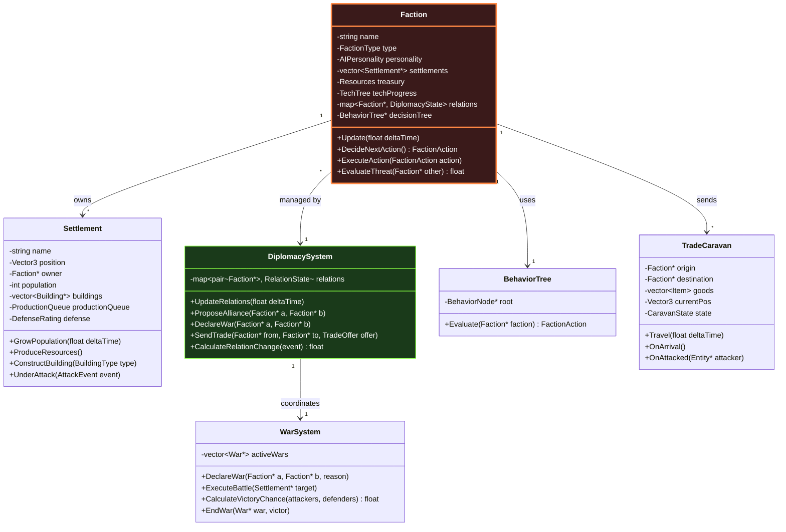
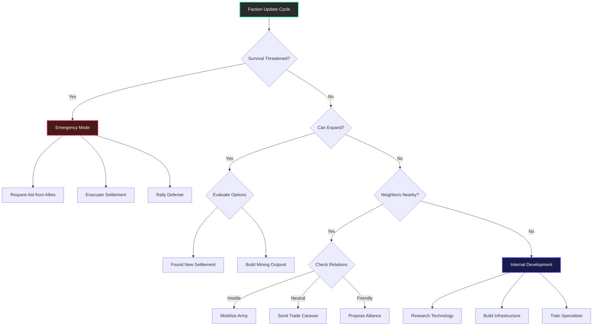

# AI Faction System - Technical Specification

**Rola**: [STRATEG] + [REŻYSER]  
**System**: Autonomous NPC Societies & Diplomacy  
**Priorytet**: 🟠 MEDIUM-HIGH (Serce "Living World")

---

## 🎯 Cel Systemu

Stworzenie **autonomicznych frakcji NPC**, które:
- Budują własne miasta **bez ingerencji gracza**
- Rozwijają się ekonomicznie (produkcja, handel)
- Prowadzą **dyplomację** (sojusze, wojny, handel)
- Generują **emergent storytelling** (legendy, konflikty)

Gracz może:
- Obserwować rozwój frakcji
- Wchodzić w interakcje dyplomatyczne
- Walczyć lub handlować
- Przejmować miasta lub zakładać własne

---

## 🏗️ Architektura Klas



---

## 🧠 AI Decision Making - Behavior Tree

### High-Level Decision Flow



### Implementation: Behavior Tree Nodes

```cpp
enum class NodeStatus { SUCCESS, FAILURE, RUNNING };

class BehaviorNode {
public:
    virtual NodeStatus Execute(Faction* faction) = 0;
};

// Composite Nodes
class SequenceNode : public BehaviorNode {
    vector<BehaviorNode*> children;
    
    NodeStatus Execute(Faction* faction) override {
        for (BehaviorNode* child : children) {
            NodeStatus status = child->Execute(faction);
            if (status != NodeStatus::SUCCESS) {
                return status; // Fail or still running
            }
        }
        return NodeStatus::SUCCESS; // All succeeded
    }
};

class SelectorNode : public BehaviorNode {
    vector<BehaviorNode*> children;
    
    NodeStatus Execute(Faction* faction) override {
        for (BehaviorNode* child : children) {
            NodeStatus status = child->Execute(faction);
            if (status != NodeStatus::FAILURE) {
                return status; // Success or running
            }
        }
        return NodeStatus::FAILURE; // All failed
    }
};

// Condition Nodes
class IsSurvivalThreatenedNode : public BehaviorNode {
    NodeStatus Execute(Faction* faction) override {
        // Check if any settlement is under siege
        for (Settlement* settlement : faction->GetSettlements()) {
            if (settlement->IsUnderAttack() || settlement->GetHP() < 0.3f) {
                return NodeStatus::SUCCESS;
            }
        }
        
        // Check if resources critically low
        if (faction->GetTreasury().food < 10) {
            return NodeStatus::SUCCESS;
        }
        
        return NodeStatus::FAILURE;
    }
};

class CanExpandNode : public BehaviorNode {
    NodeStatus Execute(Faction* faction) override {
        // Require min population and resources
        int totalPop = 0;
        for (Settlement* s : faction->GetSettlements()) {
            totalPop += s->GetPopulation();
        }
        
        if (totalPop > 50 && faction->GetTreasury().wood > 100 
            && faction->GetTreasury().stone > 50) {
            return NodeStatus::SUCCESS;
        }
        
        return NodeStatus::FAILURE;
    }
};

// Action Nodes
class FoundSettlementNode : public BehaviorNode {
    NodeStatus Execute(Faction* faction) override {
        // Find suitable location
        Vector3 location = FindGoodSettlementLocation(faction);
        
        if (location.x == -1) {
            return NodeStatus::FAILURE; // No good spot found
        }
        
        // Deduct resources
        faction->GetTreasury().wood -= 100;
        faction->GetTreasury().stone -= 50;
        
        // Create new settlement
        Settlement* newSettlement = new Settlement(location, faction);
        faction->AddSettlement(newSettlement);
        
        LogEvent("Faction " + faction->GetName() + " founded new settlement at " 
                 + VectorToString(location));
        
        return NodeStatus::SUCCESS;
    }
};

class SendTradeCaravanNode : public BehaviorNode {
    NodeStatus Execute(Faction* faction) override {
        // Find best trade partner
        Faction* partner = FindBestTradePartner(faction);
        
        if (!partner) {
            return NodeStatus::FAILURE;
        }
        
        // Create trade offer
        TradeOffer offer;
        offer.offering = DetermineExportGoods(faction);
        offer.requesting = DetermineImportNeeds(faction);
        
        // Send caravan
        TradeCaravan* caravan = new TradeCaravan(
            faction->GetCapital(), 
            partner->GetCapital(),
            offer
        );
        
        worldManager->RegisterCaravan(caravan);
        
        return NodeStatus::SUCCESS;
    }
};
```

---

## 🤝 Diplomacy System

### Relation States

```cpp
enum class RelationState {
    WAR = -100,        // Active conflict
    HOSTILE = -50,     // Cold war, border tensions
    NEUTRAL = 0,       // No formal relations
    FRIENDLY = 50,     // Trade agreements
    ALLIED = 100       // Military pact, shared victory
};

class DiplomacySystem {
private:
    struct RelationData {
        RelationState state = RelationState::NEUTRAL;
        float relationValue = 0.0f; // -100 to +100
        vector<DiplomaticEvent> history;
        optional<Treaty> activeTreaty;
    };
    
    map<pair<Faction*, Faction*>, RelationData> relations;
    
public:
    void UpdateRelations(float deltaTime) {
        for (auto& [factionPair, data] : relations) {
            Faction* a = factionPair.first;
            Faction* b = factionPair.second;
            
            // Natural decay toward neutral (0.1 per day)
            float decay = 0.1f * (deltaTime / 86400.0f);
            if (data.relationValue > 0) {
                data.relationValue -= decay;
            } else if (data.relationValue < 0) {
                data.relationValue += decay;
            }
            
            // Update state based on value
            UpdateRelationState(data);
        }
    }
    
    void ModifyRelation(Faction* a, Faction* b, float delta, string reason) {
        auto key = make_pair(a, b);
        RelationData& data = relations[key];
        
        data.relationValue = Clamp(data.relationValue + delta, -100.0f, 100.0f);
        
        DiplomaticEvent event = {
            .timestamp = worldTime,
            .change = delta,
            .reason = reason
        };
        data.history.push_back(event);
        
        UpdateRelationState(data);
        
        // Log significant changes
        if (abs(delta) > 10.0f) {
            LogEvent("Diplomacy: " + a->GetName() + " and " + b->GetName() 
                    + " relations " + (delta > 0 ? "improved" : "worsened") 
                    + " due to: " + reason);
        }
    }
    
private:
    void UpdateRelationState(RelationData& data) {
        if (data.relationValue >= 75) {
            data.state = RelationState::ALLIED;
        } else if (data.relationValue >= 25) {
            data.state = RelationState::FRIENDLY;
        } else if (data.relationValue >= -25) {
            data.state = RelationState::NEUTRAL;
        } else if (data.relationValue >= -75) {
            data.state = RelationState::HOSTILE;
        } else {
            data.state = RelationState::WAR;
        }
    }
};
```

### Diplomacy Events

```cpp
// Events that modify relations
struct DiplomaticEventType {
    static constexpr float TRADE_SUCCESS = +5.0f;
    static constexpr float GIFT_SENT = +10.0f;
    static constexpr float BORDER_VIOLATION = -15.0f;
    static constexpr float ATTACK_CARAVAN = -30.0f;
    static constexpr float DECLARE_WAR = -100.0f;
    static constexpr float PEACE_TREATY = +50.0f;
    static constexpr float SHARED_ENEMY_DEFEATED = +20.0f;
};

// Example: Trade caravan arrives
void OnTradeCaravanArrival(TradeCaravan* caravan) {
    Faction* sender = caravan->GetOrigin()->GetOwner();
    Faction* receiver = caravan->GetDestination()->GetOwner();
    
    // Exchange goods
    ExecuteTrade(caravan->GetOffer());
    
    // Improve relations
    diplomacySystem->ModifyRelation(sender, receiver, 
                                    DiplomaticEventType::TRADE_SUCCESS,
                                    "Successful trade");
}

// Example: Settlement attacked
void OnSettlementAttacked(Settlement* settlement, Faction* attacker) {
    Faction* defender = settlement->GetOwner();
    
    // Massive relation drop
    diplomacySystem->ModifyRelation(defender, attacker,
                                    DiplomaticEventType::DECLARE_WAR,
                                    "Unprovoked attack on settlement");
    
    // Allies of defender also get angry
    for (Faction* ally : defender->GetAllies()) {
        diplomacySystem->ModifyRelation(ally, attacker, -50.0f,
                                       "Attack on allied faction");
    }
}
```

---

## ⚔️ War System

### Battle Resolution (Abstract)

```cpp
class WarSystem {
public:
    struct BattleResult {
        Faction* victor;
        int attackerLosses;
        int defenderLosses;
        float territoryChange;
    };
    
    BattleResult ExecuteBattle(Settlement* target, Faction* attacker) {
        Faction* defender = target->GetOwner();
        
        // Calculate military strength
        float attackerStrength = CalculateMilitaryStrength(attacker);
        float defenderStrength = CalculateMilitaryStrength(defender) 
                               + target->GetDefenseRating();
        
        // Morale modifiers
        float attackerMorale = attacker->GetMorale();
        float defenderMorale = defender->GetMorale() * 1.2f; // Defense bonus
        
        attackerStrength *= attackerMorale;
        defenderStrength *= defenderMorale;
        
        // RNG with weighted probability
        float totalStrength = attackerStrength + defenderStrength;
        float winChance = attackerStrength / totalStrength;
        
        bool attackerWins = (RandomFloat() < winChance);
        
        BattleResult result;
        result.victor = attackerWins ? attacker : defender;
        
        // Calculate casualties (loser loses more)
        if (attackerWins) {
            result.defenderLosses = target->GetPopulation() * RandomFloat(0.3f, 0.7f);
            result.attackerLosses = attackerStrength * RandomFloat(0.1f, 0.3f);
            
            // Transfer settlement
            target->SetOwner(attacker);
            attacker->AddSettlement(target);
            defender->RemoveSettlement(target);
            
            result.territoryChange = 1.0f;
        } else {
            result.attackerLosses = attackerStrength * RandomFloat(0.4f, 0.8f);
            result.defenderLosses = target->GetPopulation() * RandomFloat(0.1f, 0.2f);
            result.territoryChange = 0.0f;
        }
        
        // Log battle
        LogEvent("BATTLE: " + attacker->GetName() + " attacked " 
                + target->GetName() + " (owned by " + defender->GetName() + "). "
                + "Victor: " + result.victor->GetName());
        
        return result;
    }
    
private:
    float CalculateMilitaryStrength(Faction* faction) {
        float strength = 0.0f;
        
        // Population contributes
        for (Settlement* s : faction->GetSettlements()) {
            strength += s->GetPopulation() * 0.1f; // 10% are soldiers
        }
        
        // Tech level multiplier
        strength *= (1.0f + faction->GetTechTree().militaryLevel * 0.2f);
        
        // Resources (can't fight without food/weapons)
        strength *= min(1.0f, faction->GetTreasury().food / 100.0f);
        
        return strength;
    }
};
```

---

## 🏙️ Procedural City Growth

### Settlement Expansion Logic

```cpp
class Settlement {
private:
    float growthTimer = 0.0f;
    static constexpr float GROWTH_INTERVAL = 300.0f; // 5 minutes
    
public:
    void Update(float deltaTime) {
        growthTimer += deltaTime;
        
        if (growthTimer >= GROWTH_INTERVAL) {
            growthTimer = 0.0f;
            AttemptGrowth();
        }
    }
    
    void AttemptGrowth() {
        // Population growth (natural increase)
        float foodPerCapita = owner->GetTreasury().food / population;
        
        if (foodPerCapita > 1.0f) {
            int newPopulation = population * RandomFloat(0.02f, 0.05f); // 2-5% growth
            population += newPopulation;
            
            LogEvent("Settlement " + name + " grew to " + std::to_string(population));
        }
        
        // Building construction (if resources available)
        if (owner->GetTreasury().wood > 50 && owner->GetTreasury().stone > 30) {
            BuildingType nextBuilding = DetermineNextBuilding();
            
            if (nextBuilding != BuildingType::NONE) {
                ConstructBuilding(nextBuilding);
            }
        }
    }
    
    BuildingType DetermineNextBuilding() {
        // Priority: Food > Housing > Defense > Production
        
        float foodRatio = owner->GetTreasury().food / population;
        if (foodRatio < 0.5f) {
            return BuildingType::FARM;
        }
        
        int housingCapacity = CountBuildings(BuildingType::HOUSE) * 4;
        if (population > housingCapacity) {
            return BuildingType::HOUSE;
        }
        
        if (GetDefenseRating() < population * 0.5f) {
            return BuildingType::WATCHTOWER;
        }
        
        // Random production building
        vector<BuildingType> prod = {
            BuildingType::SAWMILL,
            BuildingType::MINE,
            BuildingType::BLACKSMITH
        };
        return prod[RandomInt(0, prod.size() - 1)];
    }
    
    void ConstructBuilding(BuildingType type) {
        // Find valid location near settlement center
        Vector3 location = FindBuildSpot(position, 50.0f);
        
        if (location.x != -1) {
            Building* building = new Building(type, location);
            buildings.push_back(building);
            
            // Deduct resources
            owner->GetTreasury().wood -= GetBuildingCost(type).wood;
            owner->GetTreasury().stone -= GetBuildingCost(type).stone;
            
            LogEvent("Settlement " + name + " constructed " 
                    + BuildingTypeToString(type));
        }
    }
};
```

---

## 🚚 Trade Caravans

### Caravan Travel Simulation

```cpp
class TradeCaravan {
private:
    Settlement* origin;
    Settlement* destination;
    vector<Item> goods;
    Vector3 currentPos;
    Vector3 destination;
    CaravanState state = CaravanState::TRAVELING;
    float travelSpeed = 2.0f; // m/s
    
public:
    void Update(float deltaTime) {
        switch (state) {
            case CaravanState::TRAVELING:
                Travel(deltaTime);
                break;
            case CaravanState::ARRIVED:
                OnArrival();
                state = CaravanState::COMPLETED;
                break;
            case CaravanState::UNDER_ATTACK:
                // Handled by combat system
                break;
        }
    }
    
    void Travel(float deltaTime) {
        Vector3 direction = Vector3Normalize(
            Vector3Subtract(destinationPos, currentPos)
        );
        
        currentPos = Vector3Add(currentPos, 
            Vector3Scale(direction, travelSpeed * deltaTime)
        );
        
        // Check arrival
        if (Vector3Distance(currentPos, destinationPos) < 1.0f) {
            state = CaravanState::ARRIVED;
        }
        
        // Check for danger (bandits, wild animals)
        if (RandomChance(0.001f * deltaTime)) { // 0.1% chance per second
            OnAttacked();
        }
    }
    
    void OnArrival() {
        // Execute trade
        Faction* buyer = destination->GetOwner();
        Faction* seller = origin->GetOwner();
        
        // Transfer goods and payment
        for (Item& item : goods) {
            buyer->GetTreasury().AddItem(item);
            seller->GetTreasury().gold += item.value;
        }
        
        // Improve relations
        diplomacySystem->ModifyRelation(seller, buyer, 5.0f, "Trade success");
        
        LogEvent("Trade caravan from " + origin->GetName() 
                + " arrived at " + destination->GetName());
        
        // Self-destruct
        worldManager->UnregisterCaravan(this);
        delete this;
    }
    
    void OnAttacked() {
        state = CaravanState::UNDER_ATTACK;
        
        // Damage relations if attacker is known faction
        // Spawn combat encounter if player is nearby
        
        LogEvent("Trade caravan from " + origin->GetName() + " under attack!");
    }
};
```

---

## 🎭 AI Personality Types

```cpp
enum class FactionType {
    MERCHANT,      // Focuses on trade and economy
    MILITARIST,    // Aggressive expansion, strong army
    ISOLATIONIST,  // Defensive, avoids diplomacy
    DIPLOMATIC,    // Seeks alliances, peaceful
    RAIDER         // Attacks weak settlements, no cities
};

struct AIPersonality {
    FactionType type;
    
    // Behavior modifiers (0.0 - 2.0, 1.0 = normal)
    float aggressionLevel = 1.0f;
    float tradingFocus = 1.0f;
    float expansionDrive = 1.0f;
    float loyaltyToAllies = 1.0f;
    
    AIPersonality(FactionType t) : type(t) {
        switch (type) {
            case FactionType::MERCHANT:
                aggressionLevel = 0.3f;
                tradingFocus = 2.0f;
                expansionDrive = 0.8f;
                loyaltyToAllies = 1.5f;
                break;
            
            case FactionType::MILITARIST:
                aggressionLevel = 1.8f;
                tradingFocus = 0.5f;
                expansionDrive = 1.7f;
                loyaltyToAllies = 0.7f;
                break;
            
            case FactionType::ISOLATIONIST:
                aggressionLevel = 0.5f;
                tradingFocus = 0.3f;
                expansionDrive = 0.4f;
                loyaltyToAllies = 0.2f;
                break;
            
            case FactionType::DIPLOMATIC:
                aggressionLevel = 0.4f;
                tradingFocus = 1.2f;
                expansionDrive = 1.0f;
                loyaltyToAllies = 2.0f;
                break;
            
            case FactionType::RAIDER:
                aggressionLevel = 2.0f;
                tradingFocus = 0.1f;
                expansionDrive = 0.2f;
                loyaltyToAllies = 0.1f;
                break;
        }
    }
};
```

---

## 📊 Performance & Scale

| Metryka | Target | Critical |
|---------|--------|----------|
| **Factions** | 10-15 | ≤ 30 |
| **Settlements per Faction** | 3-5 | ≤ 10 |
| **Active Trade Caravans** | 5-10 | ≤ 30 |
| **Faction AI Tick Rate** | 5-10 seconds | ≥ 2 seconds |
| **Battle Resolution Time** | < 100ms | < 500ms |

---

## 🛠️ Implementation Checklist

### Faza 1: Core Faction Structure
- [ ] Stworzyć `Faction` class
- [ ] Implementować `Settlement` growth logic
- [ ] Dodać podstawowy behavior tree
- [ ] Testować z 2-3 fakcjami

### Faza 2: Diplomacy
- [ ] Stworzyć `DiplomacySystem`
- [ ] Implementować relation tracking
- [ ] Dodać diplomatic events
- [ ] Testować alliances i wojny

### Faza 3: Economics & Trade
- [ ] Stworzyć `TradeCaravan` system
- [ ] Implementować abstract economy
- [ ] Dodać trade routes visualization
- [ ] Testować multi-faction trade network

### Faza 4: Military
- [ ] Implementować `WarSystem`
- [ ] Dodać battle resolution
- [ ] Stworzyć siege mechanics
- [ ] Testować faction conquest

---

*Dokument stworzony przez: Antigravity AI [STRATEG + REŻYSER]*  
*Wersja: 1.0 | Status: TECHNICAL SPEC*
