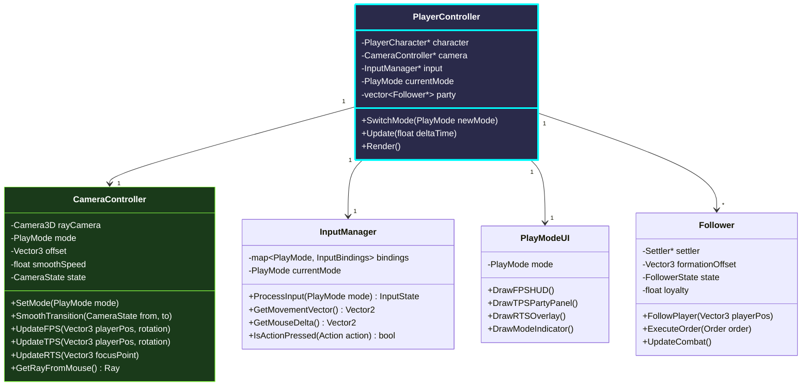
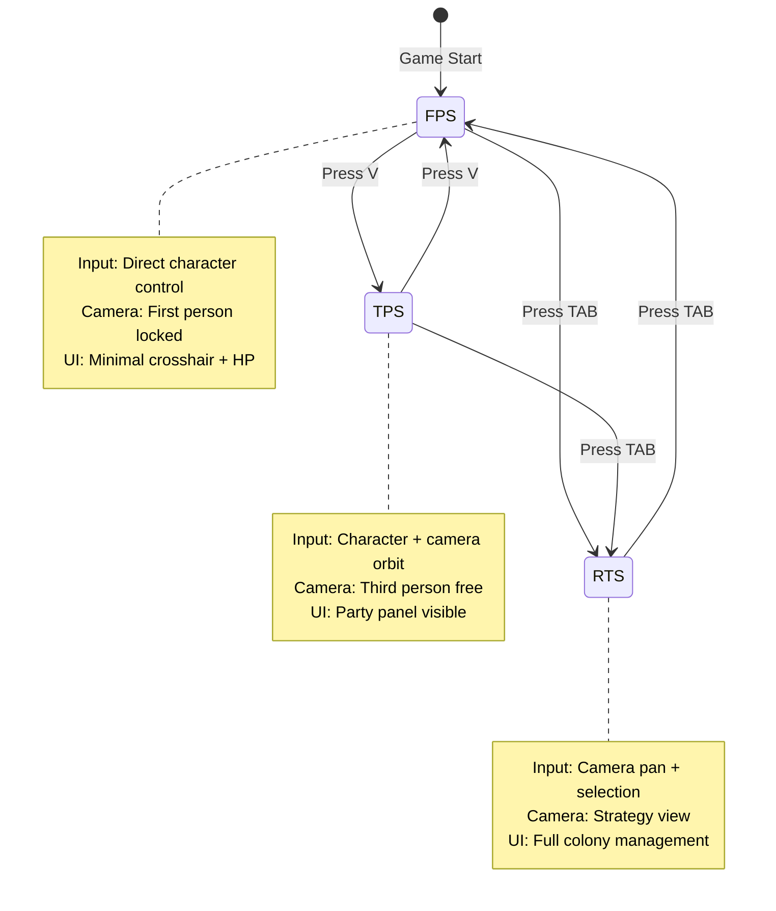

# Player Character Trinity - Technical Specification

**Rola**: [REŻYSER] + [PROJEKTANT]  
**System**: Seamless Mode Switching (FPS ↔ TPS ↔ RTS)  
**Priorytet**: 🟡 HIGH (Definiuje core gameplay experience)

---

## 🎯 Cel Systemu

Umożliwienie graczu **płynnego przełączania** między trzema trybami gry:
1. **FPS Adventure** - Pierwszoosobowa eksploracja i walka
2. **TPS Adventure** - Trzecioosobowa obserwacja i party management
3. **RTS Management** - Strategiczny widok kolonii z lotu ptaka

Każdy tryb ma **własny input context**, **UI layer** i **camera behavior**.

---

## 🏗️ Architektura Klas



---

## 🎮 Mode Definitions

### FPS Adventure Mode

**Charakterystyka:**
- Camera: Pierwsza osoba, locked do PlayerCharacter head
- Input: WASD movement, Mouse look, LMB attack, E interact
- UI: Minimal HUD (HP bar, stamina, weapon, crosshair)
- Focus: Immersion, combat, exploration

```cpp
struct FPSCameraState {
    Vector3 positionOffset = {0.0f, 1.7f, 0.0f}; // Eye height
    float FOV = 75.0f;
    float mouseSensitivity = 0.003f;
    bool lockCursor = true;
};
```

### TPS Adventure Mode

**Charakterystyka:**
- Camera: Trzecia osoba, orbit around player (3-5m distance)
- Input: Same as FPS, but can rotate camera independently
- UI: Party panel (followers HP/status), tactical markers
- Focus: Party management, tactical combat awareness

```cpp
struct TPSCameraState {
    Vector3 positionOffset = {0.0f, 2.0f, -4.0f}; // Behind and above
    float orbitDistance = 4.0f;
    float orbitSpeed = 2.0f;
    float verticalAngle = 15.0f; // Degrees above horizon
};
```

### RTS Management Mode

**Charakterystyka:**
- Camera: Free-flying orthographic/perspective hybrid, ~20-50m altitude
- Input: WASD pan, Mouse drag pan, RMB select settlers, Box selection
- UI: Full colony UI (resource bar, building panel, settler list)
- Focus: Strategy, base building, resource management

```cpp
struct RTSCameraState {
    float altitude = 30.0f;
    float panSpeed = 20.0f;
    float zoomSpeed = 5.0f;
    float minAltitude = 10.0f;
    float maxAltitude = 100.0f;
    bool orthographic = false; // Use perspective for now
};
```

---

## 🔄 Mode Transition Flow



### Smooth Transition Implementation

```cpp
void CameraController::SmoothTransition(PlayMode from, PlayMode to, float duration) {
    CameraState startState = GetStateForMode(from);
    CameraState targetState = GetStateForMode(to);
    
    float elapsed = 0.0f;
    while (elapsed < duration) {
        float t = elapsed / duration;
        t = EaseInOutCubic(t); // Smooth easing function
        
        // Interpolate camera position
        state.position = Vector3Lerp(startState.position, 
                                     targetState.position, t);
        state.rotation = QuaternionSlerp(startState.rotation, 
                                         targetState.rotation, t);
        state.FOV = Lerp(startState.FOV, targetState.FOV, t);
        
        elapsed += GetFrameTime();
        // Continue rendering during transition
        Render();
    }
    
    state = targetState; // Snap to final state
}

float EaseInOutCubic(float t) {
    return t < 0.5f ? 4 * t * t * t : 1 - pow(-2 * t + 2, 3) / 2;
}
```

---

## 🎯 Input Context Switching

```cpp
class InputManager {
private:
    struct InputBindings {
        // Movement
        KeyboardKey moveForward = KEY_W;
        KeyboardKey moveBack = KEY_S;
        KeyboardKey moveLeft = KEY_A;
        KeyboardKey moveRight = KEY_D;
        
        // Actions (different per mode)
        MouseButton primaryAction;
        MouseButton secondaryAction;
        KeyboardKey interact;
        KeyboardKey special1;
        KeyboardKey special2;
    };
    
    map<PlayMode, InputBindings> modeBindings;
    
public:
    InputManager() {
        // FPS bindings
        modeBindings[PlayMode::FPS] = {
            .primaryAction = MOUSE_LEFT_BUTTON,     // Attack
            .secondaryAction = MOUSE_RIGHT_BUTTON,  // Block
            .interact = KEY_E,                       // Pick up / Open door
            .special1 = KEY_Q,                       // Quick inventory
            .special2 = KEY_F                        // Flashlight
        };
        
        // TPS bindings
        modeBindings[PlayMode::TPS] = {
            .primaryAction = MOUSE_LEFT_BUTTON,     // Attack
            .secondaryAction = MOUSE_RIGHT_BUTTON,  // Camera orbit
            .interact = KEY_E,
            .special1 = KEY_Q,                       // Party commands
            .special2 = KEY_F                        // Formation toggle
        };
        
        // RTS bindings
        modeBindings[PlayMode::RTS] = {
            .primaryAction = MOUSE_LEFT_BUTTON,     // Select units
            .secondaryAction = MOUSE_RIGHT_BUTTON,  // Command move
            .interact = KEY_E,                       // Not used
            .special1 = KEY_B,                       // Building menu
            .special2 = KEY_C                        // Crafting menu
        };
    }
    
    InputState ProcessInput(PlayMode mode) {
        InputBindings& bindings = modeBindings[mode];
        InputState state;
        
        // Movement (same for all adventure modes)
        state.moveVector.x = IsKeyDown(bindings.moveRight) 
                           - IsKeyDown(bindings.moveLeft);
        state.moveVector.y = IsKeyDown(bindings.moveForward) 
                           - IsKeyDown(bindings.moveBack);
        
        // Actions (mode-dependent)
        state.primaryAction = IsMouseButtonPressed(bindings.primaryAction);
        state.secondaryAction = IsMouseButtonDown(bindings.secondaryAction);
        state.interact = IsKeyPressed(bindings.interact);
        
        return state;
    }
};
```

---

## 🤝 Party & Followers System

### Recruitment Mechanics

```cpp
class PlayerController {
private:
    vector<Follower*> party;
    int maxPartySize = 10;
    
public:
    bool RecruitSettler(Settler* settler) {
        if (party.size() >= maxPartySize) {
            ShowMessage("Party is full!");
            return false;
        }
        
        // Check loyalty/authority
        float authority = character->GetAuthority();
        float requiredAuthority = 10 + party.size() * 5; // Harder with more followers
        
        if (authority < requiredAuthority) {
            ShowMessage("Not enough authority to recruit!");
            return false;
        }
        
        // Successful recruitment
        Follower* follower = new Follower(settler);
        party.push_back(follower);
        
        // Remove from colony AI control
        settler->SetControlMode(ControlMode::PLAYER_FOLLOWER);
        
        ShowMessage("Recruited " + settler->name + "!");
        return true;
    }
    
    void DismissFollower(Follower* follower) {
        auto it = std::find(party.begin(), party.end(), follower);
        if (it != party.end()) {
            // Return to colony AI
            follower->GetSettler()->SetControlMode(ControlMode::AI);
            party.erase(it);
            delete follower;
        }
    }
};
```

### Formation System (TPS Mode)

```cpp
enum class Formation {
    COLUMN,      // Single file behind player
    WEDGE,       // V-shape with player at front
    LINE,        // Horizontal line
    CIRCLE       // Surround player
};

class Follower {
private:
    Formation currentFormation = Formation::COLUMN;
    int positionInFormation = 0;
    
    Vector3 CalculateFormationOffset(Vector3 playerPos, Vector3 playerForward) {
        switch (currentFormation) {
            case Formation::COLUMN:
                return playerPos + (playerForward * -2.0f * (positionInFormation + 1));
            
            case Formation::WEDGE: {
                int row = positionInFormation / 2;
                int side = (positionInFormation % 2) * 2 - 1; // -1 or +1
                Vector3 right = Vector3CrossProduct(playerForward, {0, 1, 0});
                return playerPos 
                     + (playerForward * -row * 2.0f)
                     + (right * side * row * 1.5f);
            }
            
            case Formation::LINE: {
                Vector3 right = Vector3CrossProduct(playerForward, {0, 1, 0});
                int offset = positionInFormation - (party.size() / 2);
                return playerPos + (right * offset * 2.0f);
            }
            
            case Formation::CIRCLE: {
                float angle = (2 * PI * positionInFormation) / party.size();
                float radius = 3.0f;
                return playerPos + Vector3{
                    cos(angle) * radius,
                    0,
                    sin(angle) * radius
                };
            }
        }
    }
    
public:
    void UpdateFormation(Vector3 playerPos, Vector3 playerForward) {
        Vector3 targetPos = CalculateFormationOffset(playerPos, playerForward);
        
        // Smooth movement to formation position
        settler->MoveTo(targetPos);
    }
};
```

---

## 🎨 UI Adaptation per Mode

```cpp
class PlayModeUI {
public:
    void Draw(PlayMode mode, PlayerController* player) {
        switch (mode) {
            case PlayMode::FPS:
                DrawFPSHUD(player);
                break;
            case PlayMode::TPS:
                DrawTPSHUD(player);
                break;
            case PlayMode::RTS:
                DrawRTSHUD(player);
                break;
        }
        
        // Always show mode indicator
        DrawModeIndicator(mode);
    }
    
private:
    void DrawFPSHUD(PlayerController* player) {
        // Minimal crosshair
        DrawCircle(GetScreenWidth()/2, GetScreenHeight()/2, 3, RED);
        
        // HP bar (bottom left)
        float hp = player->GetCharacter()->GetHP();
        float maxHP = player->GetCharacter()->GetMaxHP();
        DrawRectangle(10, GetScreenHeight() - 30, 200 * (hp/maxHP), 20, GREEN);
        
        // Weapon name (bottom right)
        string weapon = player->GetCharacter()->GetEquippedWeapon();
        DrawText(weapon.c_str(), GetScreenWidth() - 150, 
                 GetScreenHeight() - 30, 20, WHITE);
    }
    
    void DrawTPSHUD(PlayerController* player) {
        // Show player HP
        DrawFPSHUD(player); // Reuse
        
        // Party panel (right side)
        int y = 50;
        for (Follower* follower : player->GetParty()) {
            DrawFollowerPortrait(follower, GetScreenWidth() - 220, y);
            y += 60;
        }
        
        // Formation indicator
        DrawFormationIcon(10, 50, player->GetFormation());
    }
    
    void DrawRTSHUD(PlayerController* player) {
        // Full colony UI (reuse existing UISystem)
        DrawResourceBar();
        DrawBuildingPanel();
        DrawSettlerList();
        
        // Selection box
        if (isBoxSelecting) {
            DrawRectangleLines(selectionStart.x, selectionStart.y,
                             selectionEnd.x - selectionStart.x,
                             selectionEnd.y - selectionStart.y,
                             YELLOW);
        }
    }
    
    void DrawModeIndicator(PlayMode mode) {
        const char* modeText[] = {"FPS", "TPS", "RTS"};
        Color modeColor[] = {RED, GREEN, BLUE};
        
        DrawText(modeText[static_cast<int>(mode)], 
                 GetScreenWidth() - 80, 10, 30, 
                 modeColor[static_cast<int>(mode)]);
    }
};
```

---

## 🧪 Przykład Użycia - Main Loop

```cpp
// main.cpp - modified
void GameLoop() {
    PlayerController* playerCtrl = new PlayerController(playerCharacter);
    
    while (!WindowShouldClose()) {
        float deltaTime = GetFrameTime();
        
        // === MODE SWITCHING ===
        if (IsKeyPressed(KEY_V)) {
            // Toggle between FPS and TPS
            PlayMode current = playerCtrl->GetMode();
            if (current == PlayMode::FPS) {
                playerCtrl->SwitchMode(PlayMode::TPS);
            } else if (current == PlayMode::TPS) {
                playerCtrl->SwitchMode(PlayMode::FPS);
            }
        }
        
        if (IsKeyPressed(KEY_TAB)) {
            // Toggle RTS mode
            PlayMode current = playerCtrl->GetMode();
            if (current == PlayMode::RTS) {
                playerCtrl->SwitchMode(PlayMode::FPS);
            } else {
                playerCtrl->SwitchMode(PlayMode::RTS);
            }
        }
        
        // === UPDATE ===
        playerCtrl->Update(deltaTime);
        
        // Update world (active regions only)
        worldManager->Update(deltaTime, playerCtrl->GetPosition());
        
        // === RENDER ===
        BeginDrawing();
            ClearBackground(SKYBLUE);
            
            playerCtrl->Render(); // Handles camera + 3D scene
            
            // UI overlay
            playerCtrl->GetUI()->Draw(playerCtrl->GetMode(), playerCtrl);
        EndDrawing();
    }
}
```

---

## 🎯 Leadership & Authority System

### Koncept: Authority Score

Gracz zarabia **Authority** poprzez:
- Ukończone questy (+10)
- Zbudowane budynki (+5)
- Pokonanych wrogów (+3)
- Uratowanych NPC (+15)

Authority unlock:
- **0-20**: Nie może rekrutować followersów
- **20-50**: Może rekrutować max 3 followers
- **50-100**: Może zakładać osady (spawn Colony)
- **100+**: Może mianować zarządców (delegate management)

```cpp
class PlayerCharacter {
private:
    float authority = 0.0f;
    
public:
    void AddAuthority(float amount, string reason) {
        authority += amount;
        ShowFloatingText("+" + std::to_string(amount) + " Authority: " + reason);
    }
    
    bool CanFoundSettlement() {
        return authority >= 50.0f;
    }
    
    bool CanAppointManager() {
        return authority >= 100.0f;
    }
};
```

---

## 📊 Performance Considerations

| Aspekt | Optymalizacja |
|--------|---------------|
| **Camera Transition** | Interpolacja w 0.3-0.5s (nie blokuj input) |
| **Follower Pathfinding** | Simplified A* (max 5 followers) |
| **RTS Selection** | Spatial hash dla szybkiego box select |
| **UI Rendering** | Cache textures, redraw tylko przy zmianie |

---

## 🛠️ Implementation Checklist

### Faza 1: Camera System
- [ ] Refaktorować obecny camera code do `CameraController`
- [ ] Implementować 3 camera states (FPS/TPS/RTS)
- [ ] Dodać smooth transitions
- [ ] Testować z obecnym PlayerCharacter

### Faza 2: Input Manager
- [ ] Stworzyć `InputManager` z mode-specific bindings
- [ ] Implementować mode switching (V i TAB)
- [ ] Dodać input debouncing

### Faza 3: Party System
- [ ] Stworzyć `Follower` class
- [ ] Implementować recruitment logic
- [ ] Dodać formation system
- [ ] Testować z 1-5 followers

### Faza 4: UI Adaptation
- [ ] Stworzyć `PlayModeUI` class
- [ ] Implementować mode-specific HUDs
- [ ] Dodać mode indicator
- [ ] Polish animations

---

*Dokument stworzony przez: Antigravity AI [REŻYSER + PROJEKTANT]*  
*Wersja: 1.0 | Status: TECHNICAL SPEC*
