# Tech-Magic Fusion Arsenal

**Data**: 2026-01-03  
**Rola**: [PROJEKTANT] + [REŻYSER]  
**Filozofia**: Technologia i Magia to DWA ASPEKTY JEDNEJ SIŁY

---

## 🌟 Core Philosophy: "Clarke's Third Law"

> "Wystarczająco zaawansowana technologia jest nie do odróżnienia od magii"  
> **I odwrotnie**: Wystarczająco zrozumiana magia jest nie do odróżnienia od technologii

W Twoim świecie:
- **Mana** = Energia kwantowa (można ją mierzyć, przekształcać, magazynować)
- **Runy** = Programowanie reality (kod źródłowy wszechświata)
- **Kryształy** = Organiczne baterie + procesory
- **Cyborgizacja** = Zwiększenie kanałów mana

---

## ⚔️ Hybrid Weapons Arsenal


### Weapon Categories

#### 1. **Electro-Staff (Blunt + Energy)**
**Opis**: Metalowy kij z grawerowanymi runami i neonowymi obwodami.

**Mechanika:**
- **Podstawowy Atak**: Fizyczny cios (damage: 20)
- **Charged Attack**: Kumuluje energię elektryczną + mana (damage: 50, stun 2s)
- **Special**: "Shockwave" - AoE burst (promień 5m)

**Wymagania:**
- Skill: Melee Combat 3
- Stat: Tech Affinity 15 LUB Magic Affinity 15

**Crafting:**
- Metal Rod (tech)
- Mana Crystal (magic)
- Circuit Board (tech) + Rune Etching (magic)

---

#### 2. **Plasma-Crystal Sword (Melee + Elemental)**
**Opis**: Kryształowe ostrze zawieszone w plazmowym polu, cyborgiczny rękojeść.

**Mechanika:**
- **Podstawowy Atak**: Slash + Fire damage (30 physical + 15 fire)
- **Parry**: Plazmowe pole może odbijać pociski energetyczne
- **Special**: "Blade Beam" - Wystrzeliwuje energię na dystans

**Synergy:**
- **Dual Wielding**: Można używać z Electro-Staff (combo attacks)
- **Enchantments**: Kryształ można wymieniać (Ice, Lightning, Poison)

**Upgrade Path:**
```
Stage 1: Basic Crystal (Fire)
  ↓ [Install Cooling Chip]
Stage 2: Dual-Element (Fire + Ice)
  ↓ [Overlock Core]
Stage 3: Phase Blade (może przechodzić przez ściany)
```

---

#### 3. **Techno-Wand (Support + Utility)**
**Opis**: Smukła metalowa różdżka z holograficznym spell matrix i świecącym kryształem.

**Mechanika:**
- **Quick Cast**: Można zaprogramować 4 szybkie spells (hotkeys 1-4)
- **Spell Combos**: Łączenie 2 spell = nowy efekt
- **Overclock Mode**: 2x moc, ale ryzyko overheatu

**Example Spells:**
1. **Heal Pulse** (Magic) + **Nano Repair** (Tech) = Regenerate health + repair armor
2. **fireball** (Magic) + **Targeting System** (Tech) = Homing missiles
3. **Shield** (Magic) + **Hardlight Projector** (Tech) = Impenetrable barrier

**Crafting Requirements:**
- Core Processor (tech)
- Spell Focus Crystal (magic)
- Holographic Emitter (tech)
- Ancient Rune Database (magic)

---

#### 4. **Runic Rifle (Ranged + Precision)**
**Opis**: Futurystyczny karabin z wygrawerowanymi sigils, energy crystals jako amunicja.

**Mechanika:**
- **Ammo Types**: Wymienne kryształy (Fire, Ice, Lightning, Kinetic)
- **Scope**: Holograficzny celownik + rune-enhanced accuracy
- **Charge Shot**: Dłuższe celowanie = więcej damage + dodatkowy efekt

**Stats:**
- Base Damage: 40 (kinetic) + 20 (elemental)
- Fire Rate: 3 shots/second
- Magazine: 30 crystal charges
- Range: 100m effective

**Special Abilities:**
- **Piercing Shot**: Przechodzi przez multiple enemies (costs 5 charges)
- **Spl Bullet**: Eksploduje w 3 mniejsze pociski
- **Rune Lock**: Automatyczne tracked najbliższego enemy (aimbot etyczny)

---

#### 5. **Cyber-Spellbook (Summoning + Crowd Control)**
**Opis**: Holograficzne strony z ancient runes displayed na cyfrowym ekranie.

**Mechanika:**
- **Summon**: Conjure tech-magic hybrid creatures (drones, golems, elementals)
- **Ritual Casting**: Większe spells wymagają czasu (channeling)
- **Spell Slots**: 10 spells equipped, unlimited w inventory

**Example Summons:**
1. **Mana Drone** - Levitujący robot strzelający arcane bolts
2. **Cyber-Golem** - Tanky melee minion
3. **Glitch Elemental** - AoE debuff (confuses enemies)

**Upgrade Path:**
- Unlock more spell slots (5 → 10 → 15)
- Faster cast time (research upgrades)
- Dual summons (2 creatures at once)

---

## 👹 Hybrid Enemy Designs

### Enemy Type 1: **Techno-Wizard**


**Lore**: Mages who augmented themselves with cybernetics to channel more mana.

**Combat Behavior:**
- **Phase 1** (100-50% HP): Ranged spells (fireball, lightning)
- **Phase 2** (50-0% HP): Summons Mana Drones + uses holograms (decoys)

**Drops:**
- Spell Chip (for Techno-Wand)
- Cybernetic Implant (player can equip)
- Mana Battery

**Weaknesses:**
- EMP grenades (disables tech half)
- Dispel magic (disables spell half)
- **Best Strategy**: Alternate between anti-tech and anti-magic

---

### Enemy Type 2: **Cyber-Golem**


**Lore**: Ancient stone golems reactivated with scrapped tech implants.

**Stats:**
- HP: 500 (bardzo tanky)
- Damage: 80 (melee smash)
- Speed: Slow (0.5x player speed)

**Abilities:**
- **Rune Shield**: Absorbs 50% magic damage
- **EMP Pulse**: Disables player tech items (5s cooldown)
- **Overload**: Self-destructs when at 10% HP (massive AoE)

**Weak Points:**
- **Glowing Chest Core**: 3x damage if hit
- Stagger: Heavy weapons can knock down

**Drops:**
- Golem Core (crafting material for armor)
- Scrap Metal + Rune Fragments

---

### Enemy Type 3: **Mana-Powered Combat Drone**


**Lore**: Military drones retrofitted with mana cores for unlimited power.

**Combat Pattern:**
- **Hover**: Stays at medium distance (15m)
- **Strafe**: Constantly moving sideways
- **Attack**: Alternates laser beams (tech) and arcane bolts (magic)

**Special:**
- **Hexagonal Barrier**: Blocks frontal damage, must flank
- **Swarm Tactics**: Spawns in groups of 3-5

**Counters:**
- Hacking (tech skill) - Take control for 30s
- Anti-magic (dispel) - Drains mana, drone falls
- Sniper rifle - One-shot to crystal core

**Drops:**
- Drone Blueprint (unlock player drone companion)
- Levitation Crystal
- Weapon Mod: Homing Projectiles

---

## 🏘️ Settlement Evolution Stages

### Stage 1: **Primitive Tech-Magic Outpost**


**Population**: 5-15 settlers

**Buildings:**
- **Wooden Huts** - Solar panels na dachach (crude energy)
- **Central Campfire** - Hologram display pokazuje mapę
- **Palisade Walls** - Motion sensors wbudowane
- **Small Shrine** - Mix candles + LED lights

**Resources:**
- Basic: Wood, Stone, Food
- Tech: Scrap Electronics
- Magic: Minor Mana Crystals

**Tech-Magic Balance**: 30% tech / 70% primitive

---

### Stage 2: **Developing Hybrid Town** *(NOT GENERATED - quota limit)*

**Population**: 20-50 settlers

**Buildings** (słowny opis):
- **Stone Houses** - Neon strip lighting wbudowane w mury
- **Workshops** - Połączenie kowala (magic enchanting) i elektroniki (circuit boards)
- **Guard Towers** - Mounted crossbows + automated turrets
- **Mana Reactor** - Centralny generator łączący kryształy i tech
- **Market Square** - Holograficzne billboardy + enchanted stalls

**Tech-Magic Balance**: 50% tech / 50% magic

---

### Stage 3: **Advanced Magitech Metropolis** *(NOT GENERATED - quota limit)*

**Population**: 100+ settlers

**Buildings** (słowny opis):
- **Hybrid Skyscrapers** - Drewno/kamień base, neonowe górne piętra
- **Ley-Line Conduits** - Magiczne i fiber optic cables razem
- **Towers** - Anteny komunikacyjne + mistyczne obeliski
- **Holographic Markets** - Mixed z enchanted trade stalls
- **Mana-LED Street Lights** - Kryształy w LED obudowach

**Advanced Features:**
- **Teleportation Pads** (tech) + **Portal Runes** (magic)
- **AI Golems** patrolujące ulice
- **Sky Platforms** - Levitujące dzięki anti-grav + levitation spells

**Tech-Magic Balance**: 60% tech / 40% magic (late game tech slightly dominant)

---

## 🔮 Lore: Jak Tech i Magic Się Połączyły?

### **The Convergence Event** (200 lat przed grą)

```
Era 1: Age of Magic (Ancient)
├─ Czarodzieje rządzili światem
├─ Technology was primitive
└─ Mana freely flows from ley lines

>>> THE CATACLYSM <<<
└─ Massive magical explosion
    └─ Reality fabric damaged
        └─ Mana becomes chaotic, unpredictable

Era 2: Age of Survival (Dark Age)
├─ Magic becomes dangerous (random explosions)
├─ Scientists seek alternative: Technology
├─ Invention of "Mana Capacitors" (crystal batteries)
└─ Discovery: Tech can STABILIZE magic

Era 3: Age of Fusion (Current)
├─ Mages use tech to control magic safely
├─ Engineers use magic to power impossible tech
├─ New hybrid discipline: "Magitech Engineering"
└─ Society rebuilds using both forces
```

**Filozofia świata:**
- Nie ma "pure magic" ani "pure tech" factions
- Każdy używa obu (w różnych proporcjach)
- Konflikt to: "Ile tech? Ile magic?" (balance debate)

---

## 🎮 Gameplay Integration

### Player Progression: **Dual Skill Trees**

```mermaid
graph LR
    START[Character Creation] --> TECH[Tech Affinity]
    START --> MAGIC[Magic Affinity]
    
    TECH --> TECH1[Hacking]
    TECH --> TECH2[Engineering]
    TECH --> TECH3[Cybernetics]
    
    MAGIC --> MAGIC1[Spellcasting]
    MAGIC --> MAGIC2[Enchanting]
    MAGIC --> MAGIC3[Summoning]
    
    TECH1 & MAGIC1 --> HYBRID1[Techno-Wizard]
    TECH2 & MAGIC2 --> HYBRID2[Artificer]
    TECH3 & MAGIC3 --> HYBRID3[Cyber-Shaman]
    
    style START fill:#2a2a2a,stroke:#fff
    style HYBRID1 fill:#ff00ff,stroke:#00ffff,stroke-width:3px
    style HYBRID2 fill:#ff00ff,stroke:#00ffff,stroke-width:3px
    style HYBRID3 fill:#ff00ff,stroke:#00ffff,stroke-width:3px
```



**Mechanika:**
- Każda broń wymaga **minimum** jednego z affinity (Tech OR Magic)
- **Hybrydowe bronie** dają bonus jeśli masz OBA
- **Ultimate Builds**: Maksuj obie gałęzie = unlock fusion spells

---

## 🛠️ Crafting System

### Recipe Example: **Electro-Staff**

**Required Components:**
| Component | Type | Source |
|-----------|------|--------|
| Metal Rod | Tech | Craft from Iron |
| Mana Crystal | Magic | Mine or loot |
| Circuit Board | Tech | Craft or buy |
| Rune Etching Kit | Magic | Buy from mage vendor |

**Crafting Station:** Hybrid Workbench (requires Artificer skill 5)

**Process:**
1. Embed circuit board into metal rod (tech work)
2. Carve runes onto surface (magic work)
3. Insert mana crystal (powers both systems)
4. Test & calibrate (mini-game)

**Variants:**
- Use **Overcharged Crystals** = +50% damage, but breaks faster
- Use **Stabilized Circuits** = Slower attacks, but infinite durability

---

## 📊 Enemy Ecology

### Biome Distribution

| Biome | Common Enemies | Rare Boss |
|-------|----------------|-----------|
| **Hybrid Dungeons** | Mana Drones, Glitch Spirits | Techno-Archmage |
| **Abandoned Labs** | Rogue Robots, Cyber-Zombies | Golem Overlord |
| **Mystic Forests** | Enchanted Animals, Fae-Bots | Ancient Tree AI |
| **Desert Ruins** | Sand Golems, Solar Drones | Corrupted Titan |
| **Underground** | Mana-Mutants, Defense Turrets | Hive Mind Core |

---

## 🎯 Next Steps

### Missing Visuals (Quota Limit - wygeneruję później):
- [ ] **Advanced Settlement Stage 3** - Magitech metropolis
- [ ] **FPS Hybrid Dungeon** - Tech-magic interior

### Dodatkowe Koncepty (opcjonalne):
- [ ] **Player Character** - Różne klasy (Techno-Wizard, Cyber-Knight, Artificer)
- [ ] **Vehicles** - Hovering bike powered by anti-grav + levitation
- [ ] **Boss Enemies** - Massive hybrid threats
- [ ] **Companion NPCs** - Recruit able followers with unique tech-magic builds

---

**Co wolisz zobaczyć jako następne?**
1. Missing grafiki (za 3h gdy quota się resetuje)
2. Więcej enemy varieties?
3. Player character class concepts?
4. Zaczynamy implementację Phase 0?

---

*Dokument stworzony przez: Antigravity AI [PROJEKTANT + REŻYSER]*  
*Status: 5/7 grafik wygenerowanych, 2 pending (quota limit)*
