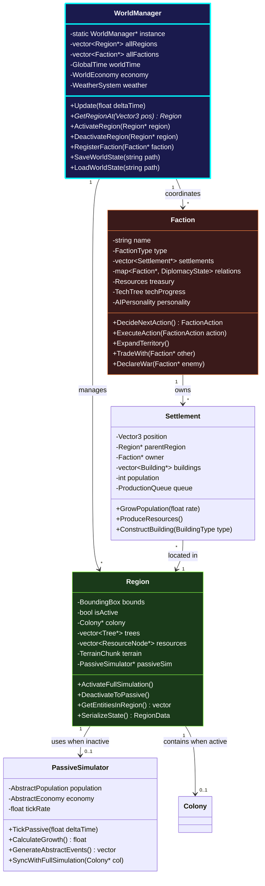
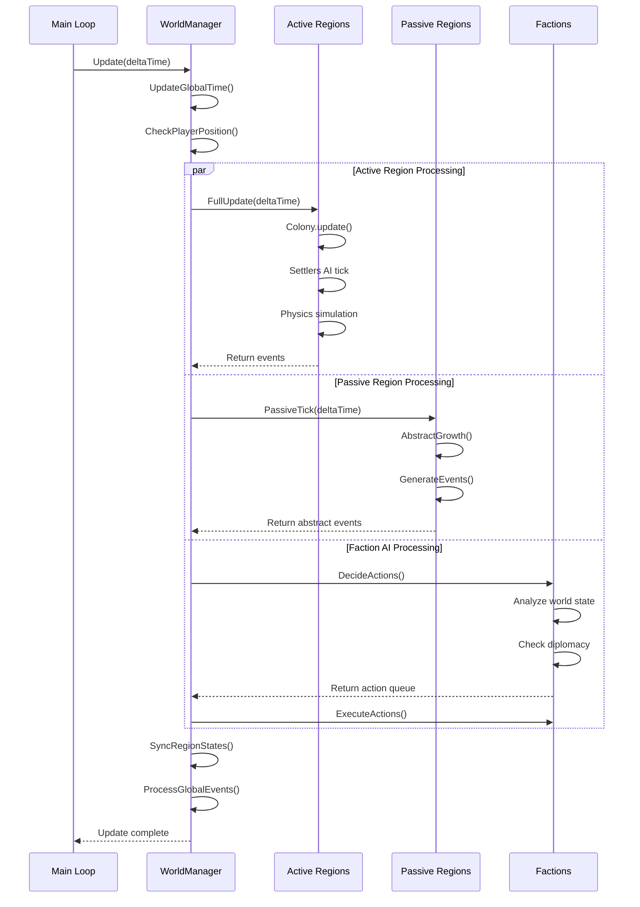

# WorldManager - Technical Specification

**Rola**: [STRATEG] + [ARCHITEKT]  
**System**: Core Living World Management  
**Priorytet**: 🔴 CRITICAL (Fundament całej architektury)

---

## 🎯 Cel Systemu

WorldManager to **centralny hub** zarządzający całym stanem gry:
- Podział świata na regiony (spatial partitioning)
- Aktywacja/deaktywacja regionów based on player proximity
- Synchronizacja AI factions działających w tle
- Global state management (czas, pogoda, ekonomia)

---

## 🏗️ Architektura Klas

### Hierarchia Dependencies



---

## 🔄 Przepływ Danych - Update Loop



---

## 💾 Serializacja i Save System

### Format Zapisu (JSON/Binary)

```cpp
struct WorldSaveData {
    // Global State
    float worldTimeElapsed;
    WeatherState currentWeather;
    
    // Regions (tylko zmienione od default)
    vector<RegionSaveData> modifiedRegions;
    
    // Factions
    vector<FactionSaveData> factions;
    
    // Player State
    PlayerSaveData player;
};

struct RegionSaveData {
    Vector3 regionCoords;
    bool wasActive;
    
    // Jeśli region był aktywny
    optional<ColonySaveData> colonyState;
    vector<TreeState> trees;
    vector<ResourceNodeState> resources;
    
    // Jeśli region był passive
    optional<PassiveSimState> passiveState;
};

struct FactionSaveData {
    string factionName;
    FactionType type;
    vector<SettlementSaveData> settlements;
    map<string, DiplomacyState> relations;
    ResourceInventory treasury;
    TechTreeProgress techProgress;
};
```

---

## ⚡ Optymalizacje Wydajnościowe

### 1. Spatial Partitioning (Quadtree/Grid)

```cpp
// Region Grid (dla szybkiego lookup)
class RegionGrid {
private:
    static const float REGION_SIZE = 100.0f; // 100x100m per region
    unordered_map<GridCoord, Region*> regionMap;
    
public:
    Region* GetRegionAt(Vector3 worldPos) {
        GridCoord coord = WorldPosToGrid(worldPos);
        if (regionMap.find(coord) == regionMap.end()) {
            // Lazy initialization - create region on demand
            regionMap[coord] = new Region(coord);
        }
        return regionMap[coord];
    }
    
    GridCoord WorldPosToGrid(Vector3 pos) {
        return {
            static_cast<int>(pos.x / REGION_SIZE),
            static_cast<int>(pos.z / REGION_SIZE)
        };
    }
};
```

### 2. Active Region Budget

```cpp
// Limit jednocześnie aktywnych regionów
class WorldManager {
private:
    static const int MAX_ACTIVE_REGIONS = 9; // 3x3 grid around player
    vector<Region*> activeRegions;
    
    void UpdateActiveRegions(Vector3 playerPos) {
        GridCoord playerGrid = WorldPosToGrid(playerPos);
        
        // Deactivate far regions
        for (auto it = activeRegions.begin(); it != activeRegions.end();) {
            Region* region = *it;
            if (Distance(region->GetGridCoord(), playerGrid) > 1) {
                region->DeactivateToPassive();
                it = activeRegions.erase(it);
            } else {
                ++it;
            }
        }
        
        // Activate nearby regions
        for (int dx = -1; dx <= 1; ++dx) {
            for (int dz = -1; dz <= 1; ++dz) {
                GridCoord coord = {playerGrid.x + dx, playerGrid.z + dz};
                Region* region = GetRegionAt(coord);
                if (!region->IsActive()) {
                    region->ActivateFullSimulation();
                    activeRegions.push_back(region);
                }
            }
        }
    }
};
```

### 3. Passive Simulation (Abstract Model)

```cpp
class PassiveSimulator {
private:
    // Abstract state (nie symulujemy jednostek)
    float population;
    float foodProduction;
    float resourceProduction;
    float defenseStrength;
    
public:
    void TickPassive(float deltaTime) {
        // Simplified growth model
        float growthRate = CalculateGrowthRate();
        population += growthRate * deltaTime;
        
        // Abstract resource production
        foodProduction = population * 0.5f; // 0.5 food per person
        resourceProduction = population * 0.3f;
        
        // Random events (bez pełnej symulacji)
        if (RandomChance(0.001f)) { // 0.1% chance per tick
            GenerateAbstractEvent(EventType::RAID);
        }
    }
    
    // Konwersja z pełnej kolonii do abstract
    void SyncFromColony(Colony* colony) {
        population = colony->settlers.size();
        foodProduction = colony->CalculateTotalFoodProduction();
        // ... extract abstract stats
    }
    
    // Konwersja z abstract do pełnej kolonii
    void SyncToColony(Colony* colony) {
        // Spawn settlers based on abstract population
        int targetSettlers = static_cast<int>(population);
        while (colony->settlers.size() < targetSettlers) {
            colony->AddSettler(/* ... */);
        }
        // ... restore buildings, resources
    }
};
```

---

## 🧪 Przykład Użycia

### Main Loop Integration

```cpp
// main.cpp - modified game loop
void GameLoop() {
    WorldManager* world = WorldManager::GetInstance();
    
    while (!WindowShouldClose()) {
        float deltaTime = GetFrameTime();
        
        // === INPUT ===
        ProcessInput();
        
        // === UPDATE ===
        world->Update(deltaTime, player.position); // Pass player pos
        
        // Update tylko active region (reszta w WorldManager)
        Region* currentRegion = world->GetRegionAt(player.position);
        if (currentRegion && currentRegion->IsActive()) {
            Colony* colony = currentRegion->GetColony();
            colony->update(deltaTime, currentRegion->GetTrees(), 
                          currentRegion->GetBuildings());
        }
        
        // === RENDER ===
        BeginDrawing();
            ClearBackground(BLACK);
            
            BeginMode3D(camera);
                // Render tylko active regions
                for (Region* region : world->GetActiveRegions()) {
                    region->Render();
                }
            EndMode3D();
            
            // UI
            DrawUI();
        EndDrawing();
    }
}
```

---

## 🚨 Edge Cases i Bezpieczeństwo

### Problem 1: Settler przekracza granicę regionu
**Rozwiązanie**: Transfer własności

```cpp
void Region::TransferSettlerToNeighbor(Settler* settler, Vector3 newPos) {
    Region* targetRegion = WorldManager::GetInstance()->GetRegionAt(newPos);
    
    if (targetRegion != this) {
        // Remove from this region
        auto it = std::find(colony->settlers.begin(), 
                           colony->settlers.end(), settler);
        if (it != colony->settlers.end()) {
            colony->settlers.erase(it);
        }
        
        // Add to target region
        if (targetRegion->IsActive()) {
            targetRegion->GetColony()->settlers.push_back(settler);
        } else {
            // Target region is passive - convert to abstract population
            targetRegion->GetPassiveSim()->AddAbstractPopulation(1);
            delete settler; // Despawn settler
        }
    }
}
```

### Problem 2: Faction akcje w nieaktywnym regionie
**Rozwiązanie**: Queue system

```cpp
class Faction {
private:
    queue<DeferredAction> pendingActions;
    
public:
    void ExecuteBuildCommand(Settlement* settlement, BuildingType type) {
        Region* region = settlement->GetParentRegion();
        
        if (region->IsActive()) {
            // Execute immediately
            region->GetColony()->StartBuildingTask(type, settlement->position);
        } else {
            // Queue for later when region activates
            DeferredAction action = {
                .type = ActionType::BUILD,
                .targetRegion = region,
                .buildingType = type
            };
            pendingActions.push(action);
        }
    }
    
    void ProcessPendingActions() {
        while (!pendingActions.empty()) {
            DeferredAction action = pendingActions.front();
            if (action.targetRegion->IsActive()) {
                // Execute now
                ExecuteAction(action);
                pendingActions.pop();
            } else {
                break; // Wait for region activation
            }
        }
    }
};
```

---

## 📊 Performance Targets

| Metryka | Target | Critical |
|---------|--------|----------|
| **Active Regions** | ≤ 9 | ≤ 16 |
| **Passive Regions** | unlimited | 1000+ |
| **Factions** | 10-20 | ≤ 50 |
| **Frame Time (Active Region)** | < 16ms (60 FPS) | < 33ms (30 FPS) |
| **Memory per Passive Region** | < 1 KB | < 10 KB |
| **Memory per Active Region** | < 50 MB | < 200 MB |

---

## 🛠️ Implementation Checklist

### Faza 1 (Miesiąc 1-2): Core Structure
- [ ] Stworzyć `WorldManager.h/.cpp` singleton
- [ ] Zaimplementować `Region` class z bounds checking
- [ ] Dodać `RegionGrid` spatial partitioning
- [ ] Refaktorować `main.cpp` do używania WorldManager
- [ ] Migrować obecną `Colony` do `Region::colony`

### Faza 2 (Miesiąc 2-3): Passive Simulation
- [ ] Stworzyć `PassiveSimulator` class
- [ ] Implementować `SyncFromColony` / `SyncToColony`
- [ ] Dodać abstract growth calculations
- [ ] Testować konwersję Active ↔ Passive

### Faza 3 (Miesiąc 3-4): Save System
- [ ] Zaprojektować `WorldSaveData` format
- [ ] Implementować `SaveWorldState` / `LoadWorldState`
- [ ] Delta compression (zapisuj tylko zmiany)
- [ ] Testować load/save cycle

---

## 🎓 Lessons from Similar Games

### Dwarf Fortress Approach
- **Simulation Depth**: Priorytetyzuj emergent behavior nad scripted events
- **World History**: Trackuj wydarzenia dla storytelling

### Rimworld Approach
- **Tick Optimization**: Nie updateuj wszystkiego co frame
- **Event-driven**: Większość systemów reaguje na eventy, nie pooling

### Minecraft Approach
- **Chunk Loading**: Player-centric activation (już mamy!)
- **Lazy Generation**: Twórz świat on-demand

---

*Dokument stworzony przez: Antigravity AI [STRATEG + ARCHITEKT]*  
*Wersja: 1.0 | Status: TECHNICAL SPEC*
