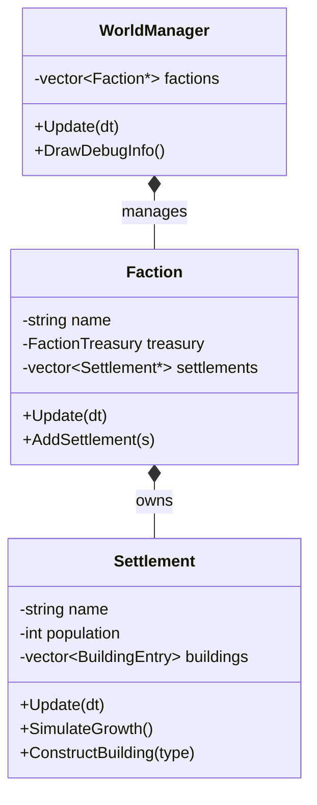

# AI Faction Prototype - Walkthrough

**Date**: 2026-01-03
**Status**: ✅ **Code Complete** | ✅ **Build Passing**
**Phase**: 0 - Rapid Prototype (Week 2)

---

## 📦 What Was Built

We have implemented the foundational layer for autonomous NPC societies. Factions now exist in the world, manage resources, and simulate settlement growth in the background.

### New Components

1.  **`Faction` Class** (`game/Faction.h/cpp`)
    *   **Role**: High-level strategist and resource manager.
    *   **Data**: Name, Color, Treasury (Gold, Food, Wood, Stone).
    *   **Limits**: Factions are currently "passive" simulations (no physical units yet).
2.  **`Settlement` Class** (`game/Settlement.h/cpp`)
    *   **Role**: Individual city/outpost owned by a faction.
    *   **Simulation**:
        *   **Population Growth**: Consumes food to spawn new population.
        *   **Production**: Farms produce food, lumbermills produce wood (abstractly added to Faction Treasury).
        *   **Construction**: Automatically builds new structures (Houses, Mills, Mines) when resources are sufficient.
3.  **WorldManager Integration**
    *   `WorldManager` now initializes two test factions: **"The Iron Empire"** (Red) and **"Dust Rebels"** (Yellow).
    *   Factions are updated in the main game loop via `WorldManager::Update()`.
    *   Debug Overlay (`DrawDebugInfo`) displays live stats for all active factions.

---

## 🏗️ Architecture

---

## 🎮 How to Verify

1.  **Run the Game**.
2.  **Look at the Debug Overlay** (Top-Left corner).
3.  Below the Region Grid, you will see the **"Active Factions"** section.
4.  **Observe**:
    *   **Population**: Should slowly increase over time.
    *   **Gold/Resources**: Values will change as settlements produce/consume.
    *   **Settlements**: "Ironhold" and "Oasis" are the starting settlements.

---

## 🔮 Next Steps (Phase 2)

This prototype proves the "simulation in background" concept. Future expansions will include:
*   **Physical Units**: Spawning actual `Settler` agents in active regions.
*   **Diplomacy**: Factions interacting (Trade/War).
*   **Visuals**: Rendering simple markers or procedural cities on the terrain.

---
*Created by Antigravity AI*
