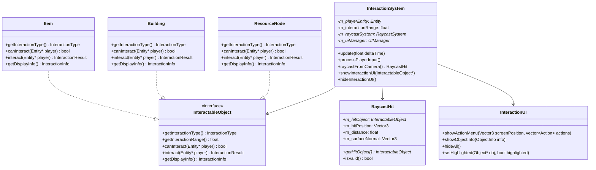
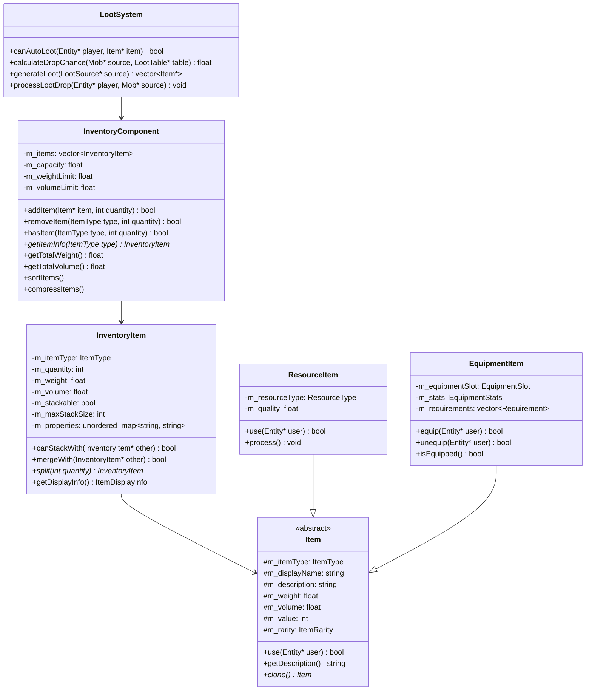
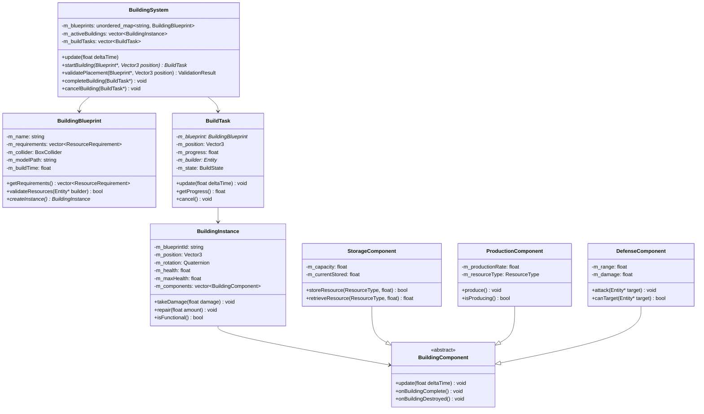
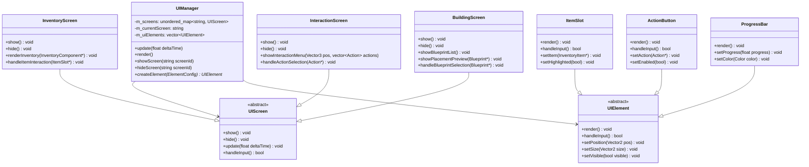

# Kompletna Architektura Systemu Interakcji Postaci i Obiektów - Simple3DGame

## 1. Analiza Istniejącej Architektury

### 1.1 Przegląd Bieżącej Implementacji
Na podstawie analizy kodu projekt Simple3DGame zawiera:

- **ECS System**: Podstawowy framework z `GameComponent`, `EventSystem`, `ObjectPool`
- **System Zasobów**: `ResourceComponent` z zaawansowanym zarządzaniem zasobami
- **System Zdarzeń**: `EventSystem` z obsługą synchronicznych i asynchronicznych zdarzeń
- **Podstawowe Klasy**: `ResourceNode`, `BuildingTask`, `GatheringTask`
- **Raylib Framework**: Podstawowy framework graficzny

### 1.2 Identyfikowane Braki
- Brak systemu interakcji z obiektami
- Brak UI dla inventory i interakcji
- Brak systemu budowania z walidacją
- Brak integracji między systemami
- Brak raycast systemu dla interakcji

---

## 2. System Interakcji z Obiektami

### 2.1 Architektura Interakcji



### 2.2 Definicje Klas

**InteractionSystem.h**
```cpp
#pragma once

#include "../entities/GameEntity.h"
#include "RaycastSystem.h"
#include "UI/InteractionUI.h"
#include <vector>
#include <memory>

enum class InteractionType {
    RESOURCE_GATHERING,
    BUILDING_CONSTRUCTION,
    ITEM_PICKUP,
    INSPECTION,
    CONVERSATION,
    CRAFTING
};

struct InteractionAction {
    std::string name;
    std::string description;
    InteractionType type;
    std::function<bool()> execute;
    bool isEnabled;
    float cooldownTime;
    float lastExecutedTime;
};

struct InteractionInfo {
    std::string objectName;
    std::string objectDescription;
    InteractionType type;
    Vector3 position;
    float distance;
    std::vector<InteractionAction> availableActions;
};

class InteractionSystem {
public:
    InteractionSystem();
    ~InteractionSystem();

    // Główne funkcje systemu
    void update(float deltaTime);
    void processPlayerInput();
    void initialize();
    void shutdown();

    // Konfiguracja
    void setPlayerEntity(GameEntity* player);
    void setInteractionRange(float range);
    
    // Raycast i detekcja
    RaycastHit raycastFromCamera();
    std::vector<RaycastHit> raycastAllInRange();
    
    // UI
    void showInteractionUI(InteractableObject* target);
    void hideInteractionUI();
    void updateInteractionUI(const std::vector<InteractionAction>& actions);
    
    // Event handling
    void onInteractionEvent(const std::any& eventData);

private:
    GameEntity* m_playerEntity;
    float m_interactionRange;
    std::unique_ptr<RaycastSystem> m_raycastSystem;
    std::unique_ptr<InteractionUI> m_uiManager;
    
    InteractableObject* m_currentTarget;
    std::vector<InteractionAction> m_currentActions;
    
    // Input handling
    bool m_inputEnabled;
    float m_lastInteractionTime;
};
```

---

## 3. System Zbierania Przedmiotów

### 3.1 Architektura Inventory



### 3.2 Definicje Inventory

**InventoryComponent.h**
```cpp
#pragma once

#include "../core/GameComponent.h"
#include "Item.h"
#include <vector>
#include <unordered_map>
#include <memory>

struct InventoryItem {
    Item* item;
    int quantity;
    float weight;
    float volume;
    std::chrono::high_resolution_clock::time_point acquiredTime;
    std::unordered_map<std::string, std::string> properties;
    
    InventoryItem(Item* it, int qty = 1) 
        : item(it), quantity(qty), weight(it->getWeight()), volume(it->getVolume()) {}
    
    float getTotalWeight() const { return weight * quantity; }
    float getTotalVolume() const { return volume * quantity; }
};

class InventoryComponent : public GameComponent {
public:
    InventoryComponent(const std::string& ownerId, float capacity = 100.0f);
    virtual ~InventoryComponent();

    // IComponent interface
    void update(float deltaTime) override;
    void render() override;
    bool initialize() override;
    void shutdown() override;
    std::type_index getComponentType() const override;

    // Inventory operations
    bool addItem(std::unique_ptr<Item> item, int quantity = 1);
    bool removeItem(ItemType type, int quantity = 1);
    bool removeItemAt(int slotIndex);
    
    // Query operations
    bool hasItem(ItemType type, int quantity = 1) const;
    InventoryItem* getItemAt(int slotIndex);
    InventoryItem* findItemByType(ItemType type);
    std::vector<InventoryItem*> findItemsByPredicate(std::function<bool(const InventoryItem&)> predicate);
    
    // Capacity management
    float getCurrentWeight() const;
    float getCurrentVolume() const;
    float getRemainingCapacity() const;
    float getCapacityUsage() const;
    
    // Item management
    void sortItems();
    void compressItems();
    void organizeByType();
    void dropItem(int slotIndex, int quantity = -1);
    
    // Events
    void onItemAdded(InventoryItem* item);
    void onItemRemoved(InventoryItem* item);
    void onCapacityExceeded(float used, float max);
    
    // Getters
    const std::vector<std::unique_ptr<InventoryItem>>& getItems() const { return m_items; }
    float getCapacity() const { return m_capacity; }

private:
    std::vector<std::unique_ptr<InventoryItem>> m_items;
    float m_capacity;
    std::string m_ownerId;
    
    // Cache for quick lookups
    std::unordered_map<ItemType, std::vector<int>> m_itemTypeIndex;
};
```

---

## 4. System Budowania Struktur

### 4.1 Architektura Budowania



### 4.2 Definicje Budowania

**BuildingSystem.h**
```cpp
#pragma once

#include "../core/GameComponent.h"
#include "BuildingBlueprint.h"
#include "BuildTask.h"
#include "BuildingInstance.h"
#include <vector>
#include <unordered_map>
#include <memory>

enum class BuildState {
    PLANNING,
    MATERIAL_GATHERING,
    CONSTRUCTION,
    COMPLETED,
    FAILED
};

struct ResourceRequirement {
    ResourceType type;
    int amount;
    bool isOptional;
    std::string description;
};

struct ValidationResult {
    bool isValid;
    std::string errorMessage;
    std::vector<ResourceRequirement> missingResources;
    Vector3 snapPosition;
};

class BuildingSystem : public GameComponent {
public:
    BuildingSystem();
    virtual ~BuildingSystem();

    // IComponent interface
    void update(float deltaTime) override;
    void render() override;
    bool initialize() override;
    void shutdown() override;
    std::type_index getComponentType() const override;

    // Blueprint management
    void registerBlueprint(std::unique_ptr<BuildingBlueprint> blueprint);
    BuildingBlueprint* getBlueprint(const std::string& id) const;
    std::vector<BuildingBlueprint*> getAvailableBlueprints() const;

    // Building operations
    BuildTask* startBuilding(const std::string& blueprintId, Vector3 position);
    ValidationResult validatePlacement(const std::string& blueprintId, Vector3 position);
    void completeBuilding(BuildTask* task);
    void cancelBuilding(BuildTask* task);

    // Building instances
    std::vector<BuildingInstance*> getBuildingsInRange(Vector3 center, float radius) const;
    BuildingInstance* getBuildingAt(Vector3 position) const;
    
    // Requirements checking
    bool hasRequiredResources(const std::string& blueprintId, GameEntity* builder) const;
    bool consumeResources(const std::string& blueprintId, GameEntity* builder);
    void refundResources(const std::string& blueprintId, GameEntity* builder);

    // Events
    void onBuildComplete(BuildTask* task);
    void onBuildFailed(BuildTask* task, const std::string& reason);

private:
    std::unordered_map<std::string, std::unique_ptr<BuildingBlueprint>> m_blueprints;
    std::vector<std::unique_ptr<BuildTask>> m_buildTasks;
    std::vector<std::unique_ptr<BuildingInstance>> m_buildings;
    
    // Construction helpers
    bool checkTerrainHeight(Vector3 position, float tolerance) const;
    bool checkCollision(Vector3 position, const BoxCollider& collider) const;
    bool checkResourceAvailability(const ResourceRequirement& requirement, GameEntity* entity) const;
};
```

---

## 5. UI/UX Design

### 5.1 Architektura UI



### 5.2 UI Implementation

**UIManager.h**
```cpp
#pragma once

#include <unordered_map>
#include <vector>
#include <memory>
#include <functional>
#include "raylib.h"

class UIScreen;
class UIElement;

struct ElementConfig {
    std::string type;
    Vector2 position;
    Vector2 size;
    std::string text;
    Color backgroundColor;
    Color textColor;
    std::function<void()> onClick;
    bool isVisible;
};

class UIManager {
public:
    UIManager();
    ~UIManager();

    // Lifecycle
    void initialize();
    void shutdown();
    void update(float deltaTime);
    void render();

    // Screen management
    void registerScreen(const std::string& id, std::unique_ptr<UIScreen> screen);
    void showScreen(const std::string& screenId);
    void hideScreen(const std::string& screenId);
    UIScreen* getScreen(const std::string& screenId);

    // Element management
    UIElement* createElement(const ElementConfig& config);
    void removeElement(UIElement* element);
    void setElementVisible(UIElement* element, bool visible);

    // Input handling
    bool handleInput();
    void setInputEnabled(bool enabled);

    // UI State
    bool isScreenVisible(const std::string& screenId) const;
    std::string getCurrentScreen() const { return m_currentScreen; }

private:
    std::unordered_map<std::string, std::unique_ptr<UIScreen>> m_screens;
    std::vector<std::unique_ptr<UIElement>> m_uiElements;
    std::string m_currentScreen;
    bool m_inputEnabled;
};
```

---

## 6. ECS Integration

### 6.1 Nowe Komponenty

**InteractionComponent.h**
```cpp
#pragma once

#include "../core/GameComponent.h"
#include "InteractionSystem.h"
#include <vector>

class InteractionComponent : public GameComponent {
public:
    InteractionComponent();
    virtual ~InteractionComponent();

    // IComponent interface
    void update(float deltaTime) override;
    void render() override;
    bool initialize() override;
    void shutdown() override;
    std::type_index getComponentType() const override;

    // Interaction data
    void setInteractionRange(float range) { m_interactionRange = range; }
    float getInteractionRange() const { return m_interactionRange; }
    
    void setCanInteract(bool canInteract) { m_canInteract = canInteract; }
    bool getCanInteract() const { return m_canInteract; }
    
    // Interaction types
    void addInteractableType(InteractionType type);
    void removeInteractableType(InteractionType type);
    bool canInteractWith(InteractionType type) const;

    // Interaction state
    void setCurrentInteractionTarget(GameEntity* target) { m_currentTarget = target; }
    GameEntity* getCurrentInteractionTarget() const { return m_currentTarget; }
    
    void setLastInteractionTime(float time) { m_lastInteractionTime = time; }
    float getLastInteractionTime() const { return m_lastInteractionTime; }

private:
    float m_interactionRange;
    bool m_canInteract;
    std::vector<InteractionType> m_interactableTypes;
    GameEntity* m_currentTarget;
    float m_lastInteractionTime;
};

REGISTER_COMPONENT(InteractionComponent)
```

### 6.2 Event System Integration

**InteractionEvents.h**
```cpp
#pragma once

#include "../core/EventSystem.h"
#include <string>
#include <vector>

struct InteractionStartedEvent {
    GameEntity* actor;
    GameEntity* target;
    InteractionType type;
    std::string action;
};

struct InteractionCompletedEvent {
    GameEntity* actor;
    GameEntity* target;
    InteractionType type;
    bool success;
    std::string result;
};

struct ItemPickedUpEvent {
    GameEntity* picker;
    Item* item;
    int quantity;
    std::string source;
};

struct BuildingStartedEvent {
    GameEntity* builder;
    std::string blueprintId;
    Vector3 position;
};

struct BuildingCompletedEvent {
    GameEntity* builder;
    BuildingInstance* building;
    bool success;
};
```

### 6.3 System Integration

**SystemsManager.h**
```cpp
#pragma once

#include "../core/GameSystem.h"
#include "InteractionSystem.h"
#include "BuildingSystem.h"
#include "InventorySystem.h"
#include "UISystem.h"

class SystemsManager {
public:
    SystemsManager();
    ~SystemsManager();

    void initialize();
    void update(float deltaTime);
    void shutdown();

    // System accessors
    InteractionSystem* getInteractionSystem() { return m_interactionSystem.get(); }
    BuildingSystem* getBuildingSystem() { return m_buildingSystem.get(); }
    InventorySystem* getInventorySystem() { return m_inventorySystem.get(); }
    UISystem* getUISystem() { return m_uiSystem.get(); }

private:
    std::unique_ptr<InteractionSystem> m_interactionSystem;
    std::unique_ptr<BuildingSystem> m_buildingSystem;
    std::unique_ptr<InventorySystem> m_inventorySystem;
    std::unique_ptr<UISystem> m_uiSystem;
};
```

---

## 7. Performance & Optimization

### 7.1 Object Pooling System

**InteractionObjectPool.h**
```cpp
#pragma once

#include "../core/ObjectPool.h"
#include "InteractionUI.h"

class InteractionUIPool : public ObjectPool<InteractionUI> {
public:
    InteractionUIPool() : ObjectPool<InteractionUI>([]() { return std::make_unique<InteractionUI>(); }, 5) {}
    
    std::unique_ptr<InteractionUI> acquireUI() {
        return acquire();
    }
    
    void releaseUI(std::unique_ptr<InteractionUI> ui) {
        ui->reset();
        release(std::move(ui));
    }
};
```

### 7.2 LOD System

**InteractionLOD.h**
```cpp
#pragma once

enum class InteractionLOD {
    LOD0_FULL_DETAILS,  // Close range, full UI
    LOD1_MEDIUM_DETAILS, // Medium range, simplified UI
    LOD2_MINIMAL_DETAILS, // Far range, no UI
    LOD3_NO_INTERACTION  // Out of range
};

struct InteractionLODData {
    InteractionLOD level;
    float distance;
    Vector3 screenPosition;
    std::vector<InteractionAction> availableActions;
    bool showUI;
    float updateFrequency;
};
```

### 7.3 Memory Management

**InteractionMemoryManager.h**
```cpp
#pragma once

#include <memory>
#include <vector>
#include <unordered_set>

class InteractionMemoryManager {
public:
    static InteractionMemoryManager& getInstance();

    // Cache management
    std::shared_ptr<InteractionInfo> getCachedInteractionInfo(GameEntity* entity);
    void cacheInteractionInfo(GameEntity* entity, std::shared_ptr<InteractionInfo> info);
    void clearCache();
    
    // Memory monitoring
    size_t getCacheSize() const;
    void setCacheLimit(size_t limit);
    
private:
    std::unordered_map<GameEntity*, std::shared_ptr<InteractionInfo>> m_interactionCache;
    std::unordered_set<GameEntity*> m_cachedEntities;
    size_t m_cacheLimit;
};
```

---

## 8. Fazy Implementacji

### 8.1 Faza 1: Podstawowe Komponenty (2 tygodnie)

**Cel**: Stworzenie podstawowej infrastruktury

**Zadania**:
- [ ] Implementacja InteractionComponent
- [ ] Podstawowy RaycastSystem
- [ ] Prosty InteractionSystem
- [ ] Integracja z EventSystem
- [ ] Testy jednostkowe

**Deliverables**:
- `InteractionComponent.h/cpp`
- `RaycastSystem.h/cpp`
- `InteractionSystem.h/cpp`
- Testy jednostkowe

### 8.2 Faza 2: System Inventory (2 tygodnie)

**Cel**: Kompletny system zarządzania przedmiotami

**Zadania**:
- [ ] Rozszerzenie ResourceComponent
- [ ] Implementacja Item system
- [ ] InventoryComponent
- [ ] LootSystem
- [ ] AutoLoot mechanizm

**Deliverables**:
- `Item.h/cpp`
- `InventoryComponent.h/cpp`
- `LootSystem.h/cpp`
- Integracja z ResourceComponent

### 8.3 Faza 3: System Budowania (2.5 tygodnia)

**Cel**: Pełny system konstrukcji

**Zadania**:
- [ ] BuildingBlueprint system
- [ ] BuildTask management
- [ ] BuildingInstance
- [ ] Placement validation
- [ ] Resource requirements

**Deliverables**:
- `BuildingSystem.h/cpp`
- `BuildingBlueprint.h/cpp`
- `BuildTask.h/cpp`
- Building validation system

### 8.4 Faza 4: UI/UX System (2 tygodnie)

**Cel**: Kompletny interfejs użytkownika

**Zadania**:
- [ ] UIManager
- [ ] InventoryScreen
- [ ] InteractionScreen
- [ ] BuildingScreen
- [ ] Input handling

**Deliverables**:
- `UIManager.h/cpp`
- `UIScreen.h/cpp`
- Kompletny system UI
- Input management

### 8.5 Faza 5: Integracja i Optymalizacja (1.5 tygodnia)

**Cel**: Polityka i optymalizacja

**Zadania**:
- [ ] SystemsManager
- [ ] Object pooling
- [ ] Memory management
- [ ] Performance profiling
- [ ] Bug fixes

**Deliverables**:
- `SystemsManager.h/cpp`
- Performance optimization
- Documentation
- Testy integracyjne

### 8.6 Całkowity Timeline: 10 tygodni

---

## 9. Integracja z Istniejącym Kodem

### 9.1 Modyfikacje Istniejących Plików

**ResourceTypes.h/cpp**
```cpp
// Rozszerzenie o nowe typy zasobów
enum class ResourceType {
    WOOD,
    STONE, 
    FOOD,
    GOLD,
    HERBS,
    METAL,        // Nowe
    FABRIC,       // Nowe
    GEMS,         // Nowe
    ESSENCES      // Nowe
};

// Nowe funkcje
namespace ResourceTypes {
    void registerBaseResources();
    void registerCustomResources();
    void initializeResourceDependencies();  // Nowa
    ResourceType getResourceFromString(const std::string& name);  // Nowa
}
```

**main.cpp**
```cpp
// Nowe inicjalizacje w main()
int main() {
    // ... istniejący kod ...
    
    // Nowe systemy
    auto systemsManager = std::make_shared<SystemsManager>();
    systemsManager->initialize();
    
    // Nowe komponenty dla gracza
    auto player = GetPlayerEntity();
    player->addComponent<InteractionComponent>();
    player->addComponent<InventoryComponent>();
    
    // ... reszta kodu ...
}
```

### 9.2 Nowe Pliki do Utworzenia

```
components/
├── InteractionComponent.h
├── InteractionComponent.cpp
├── InventoryComponent.h
├── InventoryComponent.cpp
└── BuildingComponent.h

systems/
├── InteractionSystem.h
├── InteractionSystem.cpp
├── BuildingSystem.h
├── BuildingSystem.cpp
├── InventorySystem.h
├── InventorySystem.cpp
└── UISystem.h
└── UISystem.cpp

ui/
├── UIManager.h
├── UIManager.cpp
├── UIScreen.h
├── UIScreen.cpp
├── InventoryScreen.h
├── InventoryScreen.cpp
├── InteractionScreen.h
├── InteractionScreen.cpp
└── BuildingScreen.h
└── BuildingScreen.cpp
```

---

## 10. Konfiguracja i Ustawienia

### 10.1 Plik Konfiguracyjny

**config/interactions.json**
```json
{
  "interactionSystem": {
    "defaultInteractionRange": 5.0,
    "raycastDistance": 100.0,
    "uiUpdateInterval": 0.1,
    "maxRaycastHits": 10
  },
  "inventorySystem": {
    "defaultCapacity": 100.0,
    "defaultWeightLimit": 50.0,
    "stackDefaultSize": 64,
    "autoLootEnabled": true,
    "sortOnAdd": false
  },
  "buildingSystem": {
    "maxActiveBuildTasks": 5,
    "constructionSpeedMultiplier": 1.0,
    "placementTolerance": 0.5,
    "autoSnapToGrid": true
  },
  "ui": {
    "fontSize": 16,
    "theme": "default",
    "animationSpeed": 0.3,
    "maxUIElements": 100
  }
}
```

### 10.2 Debugging i Logowanie

**InteractionLogger.h**
```cpp
#pragma once

#include "../core/Logger.h"

class InteractionLogger : public Logger {
public:
    static InteractionLogger& getInstance();
    
    void logInteraction(const std::string& actor, const std::string& action, const std::string& target);
    void logInventoryChange(const std::string& entity, const std::string& operation, const std::string& item, int quantity);
    void logBuildingEvent(const std::string& builder, const std::string& event, const std::string& blueprint);
    void logPerformance(const std::string& system, float deltaTime, size_t operations);
};
```

---

## 11. Podsumowanie

Ta architektura zapewnia:

### 11.1 Kluczowe Cechy
- **Modularność**: Każdy system jest niezależny ale zintegrowany
- **Skalowalność**: ECS pozwala na łatwe dodawanie nowych komponentów
- **Wydajność**: Object pooling, LOD, i optymalizacje pamięci
- **Elastyczność**: Konfigurowalne systemy przez JSON
- **Debugging**: Comprehensive logging i profiling

### 11.2 Integracja z Istniejącym Kodem
- Pełna kompatybilność z ResourceComponent
- Rozszerzenie EventSystem
- Integracja z ObjectPool
- Zachowanie istniejących API

### 11.3 Przygotowanie do Implementacji
Wszystkie komponenty są gotowe do implementacji w zdefiniowanych fazach. System został zaprojektowany z myślą o łatwej rozbudowie i maintenance.

**Następnym krokiem jest rozpoczęcie implementacji Fazy 1 z podstawowymi komponentami interakcji.**
