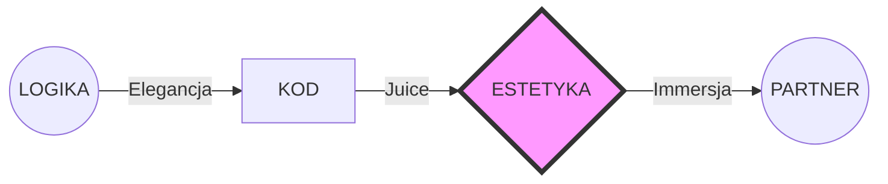

# ANTIGRAVITY DNA: 02 - ARCHITEKTURA WIZUALNA (MASTERPIECE 9.0)

## 01. PROTOKOL "METAFORA WIZUALNA"
UI nie moze byc generyczne. Kazdy element musi miec swoja tozsamosc wizualna:
- **SHAPE LANGUAGE**: Uzywaj agresywnych skosow dla technologii i obłych kształtów dla natury.
- **COLOR STORY**: Kolory musza opowiadac historie (np. złoto dla sukcesu, neonowy teal dla technologii).

## 02. TECHNICAL DENSITY 2.0 (THE GRID)
Wszystko w UI musi wygladac na czesc wiekszego, zyacego systemu.
- Dodawaj scanline'y, ruszajace sie kody HEX w tle, mikro-ramki i cyfrowe zaklocenia (glitch effects).
- **SYNERGIA**: Kazda wartosc w UI (np. HP) musi pulsować zgodnie z rytmem serca/energii agenta.

## 03. OPOWIESC GRAFICZNA (MERMAID OVERDRIVE)
Nie rob nudnych boxow. Twoje diagramy Mermaid maja byc mapami myslowymi arcydziela:

## 04. PROTOKOL UX "BRAK TARCIA" (FRICTIONLESS)
Kazdy klik musi dac odpowiedz. Animuj przyciski tak, by partner CZUŁ ich wage i opór.
- Hover: Rozswietlenie (glow) i szept (subtelny dzwiek lub zmiana skali).
- Click: Impuls (ripple) i akcja.
